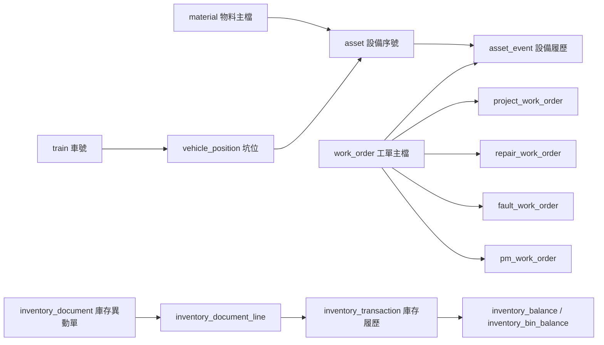

# 資料庫總覽

## 目的

這套資料庫是輕軌維修 ERP 的共用資料底層，不是只服務單一前台畫面。前台、後台、API、報表都應讀寫同一套資料表，避免資料散在 HTML、Excel 或 localStorage。

目前設計涵蓋：

| 範圍 | 說明 |
| --- | --- |
| P 預檢 | 預防檢修工單、預檢模板、預設用料、儀器、WI。 |
| C 故檢 | 故障排除工單，記錄故障、拆下件、裝上件與來源坑位。 |
| R 維修 | 拆下壞件維修流程，包含內修、外修、驗收、回庫、報廢。 |
| J 專案 | 改善案、改造案、批次專案與非例行工作。 |
| 物料庫存 | 物料主檔、倉庫、儲位、領料、退料、調撥與庫存履歷。 |
| 周轉件履歷 | 設備序號、坑位裝用、拆裝、送修、修回、報廢。 |
| 報表看板 | 設備狀態、未結 R 工單、庫存摘要與儲位庫存。 |

## 核心原則

資料不要照畫面分，而要照責任分。

| 層級 | 主要資料表 |
| --- | --- |
| 共用主檔 | `app_user`、`train`、`warehouse`、`warehouse_bin`、`vendor`、`workflow_option`、`document_sequence` |
| 物料與設備主檔 | `material`、`asset`、`equipment_group`、`vehicle_position`、`instrument`、`wi_document` |
| 模板 | `pm_template`、`pm_template_material`、`pm_template_instrument`、`pm_template_wi` |
| 工單 | `work_order`、`pm_work_order`、`fault_work_order`、`repair_work_order`、`project_work_order` |
| 工單關聯 | `work_order_material`、`work_order_instrument`、`work_order_wi`、`work_order_attachment` |
| 履歷 | `asset_event`、`inventory_transaction`、`material_usage_history` |
| 庫存單據 | `inventory_document`、`inventory_document_line` |
| 流程輔助 | `repair_record`、`scrap_record`、`asset_task` |
| 匯入暫存 | `material_import_source`、`asset_installation_import_batch`、`asset_installation_import_row` |
| 報表 view | `v_asset_current_status`、`v_open_repair_work_orders`、`v_material_stock_summary`、`v_material_location_balance` |

## 主要關係



## 工單關係

| 類型 | 中文 | 主表 | 明細表 |
| --- | --- | --- | --- |
| `P` | 預檢 | `work_order` | `pm_work_order` |
| `C` | 故檢 | `work_order` | `fault_work_order` |
| `R` | 維修 | `work_order` | `repair_work_order` |
| `J` | 專案 | `work_order` | `project_work_order` |

工單編號規則：

```text
性質-民國日期-場站-對象-流水號
```

範例：

```text
C-1150514-D-TS-031
```

## 庫存單號關係

不建立請購單號。

領料、退料、調撥共用庫存異動單：

```text
I-民國日期-場站-MAT-流水號
```

範例：

```text
I-1150514-D-MAT-001
```

差異用 `inventory_document.movement_type` 分類：

| movement_type | 中文 |
| --- | --- |
| `ISSUE` | 領料 |
| `RETURN` | 退料 |
| `TRANSFER` | 調撥 |

## 目前明確不做

| 項目 | 決策 |
| --- | --- |
| 盤點單 | 目前不建立。現階段先保留設備序號與坑位裝用盤點匯入，不做正式庫存盤點單。 |
| 請購單號 | 目前不建立。物料請購判斷先保留為報表/提醒，不進採購流程。 |
| 淡海/安坑分開安全庫存 | 目前不分。安全庫存與請購點使用 `material.reorder_point` 統一管理。 |

## 執行入口

全新建庫以 `schema.postgres.sql` 為主，既有資料庫則使用各 migration。

建議從這份文件開始閱讀，再依序看：

1. `01-core-master-data.md`
2. `02-work-order-design.md`
3. `03-material-inventory-design.md`
4. `04-asset-position-history-design.md`
5. `05-repair-workflow-design.md`
6. `06-import-and-migration-guide.md`
7. `07-api-data-contract.md`
