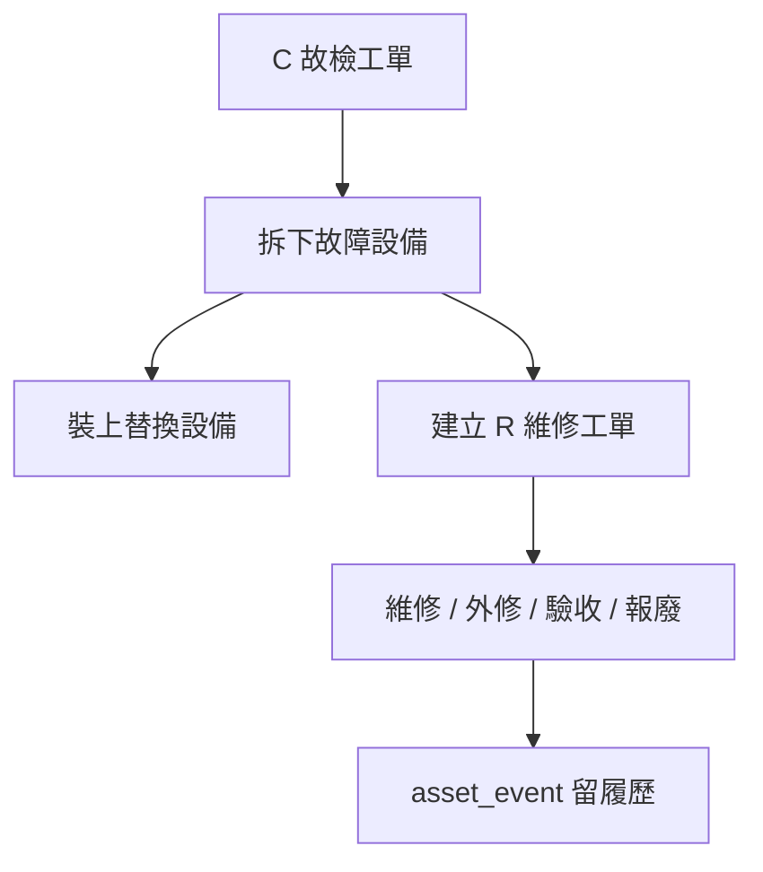

# 工單設計

## 工單總表

所有工單都先進 `work_order`，再依工單性質進入對應明細表。

| 類型 | 中文 | 明細表 | 用途 |
| --- | --- | --- | --- |
| `P` | 預檢 | `pm_work_order` | 定期預防檢修。 |
| `C` | 故檢 | `fault_work_order` | 故障排除與現場拆裝。 |
| `R` | 維修 | `repair_work_order` | 拆下壞件後續維修、外修、驗收、報廢。 |
| `J` | 專案 | `project_work_order` | 改善案、改造案、批次專案與非例行工作。 |

## 工單編號

格式：

```text
性質-民國日期-場站-對象-流水號
```

範例：

```text
C-1150514-D-TS-031
```

拆解：

| 段落 | 說明 |
| --- | --- |
| `C` | 工單性質。 |
| `1150514` | 民國日期。 |
| `D` | 場站，淡海。 |
| `TS` | 對象，列車。 |
| `031` | 當日第 31 張。 |

流水號由 `document_sequence` 控制，可透過 `next_document_no()` 產生。

## P 預檢工單

| 資料表 | 用途 |
| --- | --- |
| `pm_template` | 預檢模板，例如 P1/P2/P3/P4。 |
| `pm_template_material` | 模板預設用料。 |
| `pm_template_instrument` | 模板預設儀器。 |
| `pm_template_wi` | 模板預設 WI。 |
| `pm_work_order` | 實際 P 工單明細。 |

P 工單適合由模板帶出預設資料，再讓現場確認實際使用量。

## C 故檢工單

| 欄位 | 說明 |
| --- | --- |
| `fault_category` | 故障類別。 |
| `fault_description` | 故障描述。 |
| `vehicle_position_id` | 故障所在坑位。 |
| `removed_asset_id` | 拆下的故障設備。 |
| `installed_asset_id` | 裝上的替換設備。 |
| `fault_found_at` | 發現時間。 |
| `fault_closed_at` | 故障排除完成時間。 |

C 工單負責現場故障排除與拆裝來源。若拆下件需要維修，再建立 R 工單。

## C 接 R 流程



規則：

1. C 工單處理「車上故障」。
2. R 工單處理「拆下來的壞件」。
3. 裝上件只作履歷參照，不另外建立 R 工單。
4. 拆下、裝上、送修、修回、回庫、報廢都要寫 `asset_event`。

## R 維修工單

R 工單主狀態放在 `work_order.status`，明細放在 `repair_work_order`。

| 欄位 | 說明 |
| --- | --- |
| `source_fault_work_order_id` | 來源 C 工單。 |
| `removed_asset_id` | 拆下壞件。 |
| `installed_asset_id` | 當時裝上件，僅供履歷參照。 |
| `repair_method` | 待判定、內修、外修、報廢。 |
| `current_place` | 待修區、內修區、廠商/採購驗收中、備品倉、報廢區。 |
| `outsourcing_status` | 未送修、已送修、已修回、採購驗收中、採購驗收完成。 |
| `acceptance_result` | 未處理、合格、退回、不合格。 |
| `next_action` | 下一步建議。 |
| `risk_tags` | 風險標籤。 |

完整 R 流程見 `05-repair-workflow-design.md`。

## J 專案工單

J 工單用於非例行作業：

| 情境 | 範例 |
| --- | --- |
| 改善案 | 某系統穩定性改善。 |
| 改造案 | 設備改裝、線路調整。 |
| 批次專案 | 多車同時改修。 |
| 非例行工作 | 主管交辦或特殊專案。 |

## 工單關聯

| 資料表 | 用途 |
| --- | --- |
| `work_order_material` | 工單用料，含預估量與實際量。 |
| `work_order_instrument` | 工單使用儀器。 |
| `work_order_wi` | 工單引用 WI。 |
| `work_order_attachment` | 工單附件。 |

這些關聯表讓 P/C/R/J 共用同一套物料、儀器、WI 與附件機制。
