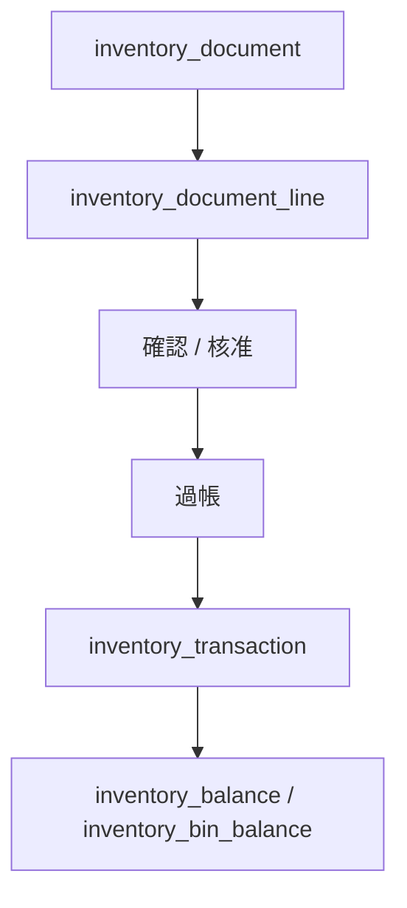

# 物料與庫存設計

## 分層

| 層級 | 資料表 | 說明 |
| --- | --- | --- |
| 物料主檔 | `material` | 料號、名稱、規格、單位、系統碼、類別碼、請購點。 |
| 用量歷史 | `material_usage_history` | 年度、月份、近一年用量統計。 |
| 庫存單據 | `inventory_document`、`inventory_document_line` | 領料、退料、調撥共用單據。 |
| 庫存快照 | `inventory_balance`、`inventory_bin_balance` | 目前庫存數量。 |
| 庫存履歷 | `inventory_transaction` | 已過帳的不可隨意改異動紀錄。 |
| 匯入來源 | `material_import_source` | Excel 原始列追溯。 |

## 物料主檔

`material` 只保存「物料是什麼」。

| 欄位 | 說明 |
| --- | --- |
| `part_no` | 完整料號。 |
| `material_name` | 物料名稱。 |
| `spec` | 規格。 |
| `unit` | 單位。 |
| `system_code` | 系統碼，例如 50、95、96。 |
| `category_code` | 類別碼。 |
| `category_name` | 類別名稱。 |
| `sequence_no` | 流水號。 |
| `type_code` | 型式碼。 |
| `repairable` | 是否可修。 |
| `is_serialized` | 是否需要序號管理。 |
| `reorder_point` | 統一請購點/安全庫存水位。 |

安全庫存目前不分淡海、安坑，因為調用快，先用 `reorder_point` 統一管理。

## 用量歷史

`material_usage_history` 保存時間序列資料，不放在 `material`。

| 原 Excel 欄位 | 新位置 |
| --- | --- |
| `111年發料量` | `period_type=YEAR`、`roc_year=111`、`usage_type=ISSUE` |
| `112年發料量` | `period_type=YEAR`、`roc_year=112`、`usage_type=ISSUE` |
| `113年發料量` | `period_type=YEAR`、`roc_year=113`、`usage_type=ISSUE` |
| `114年1月` 到 `114年12月` | `period_type=MONTH`、`roc_year=114`、`usage_month=1-12` |
| `近1年故障用量` | `period_type=ROLLING_12M`、`usage_type=FAULT` |
| `預估1年故障量` | `period_type=ROLLING_12M`、`usage_type=FORECAST_FAULT` |

未來領料流程上線後，新用量可以從 `inventory_transaction` 統計出來。

## 庫存位置

`warehouse` 不只代表傳統倉庫，也代表保管位置。

| location_type | 說明 |
| --- | --- |
| `CENTER_WAREHOUSE` | 中心倉庫，通常為未領料可發料。 |
| `SUB_STATION` | 分存站，通常為已領料保管。 |
| `FIELD` | 現場。 |
| `VEHICLE` | 車上。 |
| `PERSON` | 個人保管。 |
| `VENDOR` | 廠商。 |
| `SCRAP` | 報廢位置。 |

庫存狀態：

| stock_status | 說明 |
| --- | --- |
| `AVAILABLE` | 可發料。 |
| `ISSUED` | 已領料。 |
| `IN_USE` | 已使用或裝用中。 |
| `QUARANTINE` | 待判定。 |
| `REPAIR` | 維修中。 |
| `SCRAPPED` | 已報廢。 |

## 庫存異動單

不建立請購單號。

領料、退料、調撥共用 `inventory_document`：

```text
I-民國日期-場站-MAT-流水號
```

範例：

```text
I-1150514-D-MAT-001
```

| movement_type | 中文 | 說明 |
| --- | --- | --- |
| `ISSUE` | 領料 | 中心倉庫發到分存站、現場、個人、車上或工單。 |
| `RETURN` | 退料 | 已領料位置退回中心倉庫。 |
| `TRANSFER` | 調撥 | 位置與位置之間移動。 |

`inventory_document` 是人員操作的單據，`inventory_transaction` 是過帳後的庫存履歷。



## 庫存查詢原則

| 問題 | 查詢邏輯 |
| --- | --- |
| 可以領多少 | 中心倉庫 `AVAILABLE`。 |
| 總共有多少 | 加總所有位置與狀態。 |
| 在哪些地方 | `v_material_location_balance` 或 `inventory_bin_balance`。 |
| 是否需請購 | `v_material_stock_summary.stock_advice`。 |
| 用量趨勢 | `material_usage_history`，後續可由 `inventory_transaction` 統計。 |

## 不做盤點單

目前不建立正式庫存盤點單。現階段只保留設備序號與坑位裝用盤點匯入表，庫存盤點流程等後續真的需要再設計。
