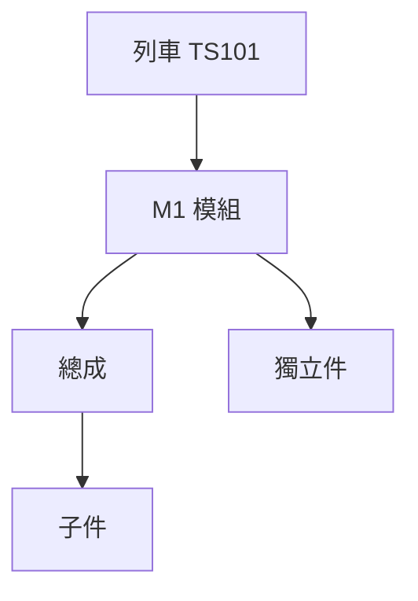
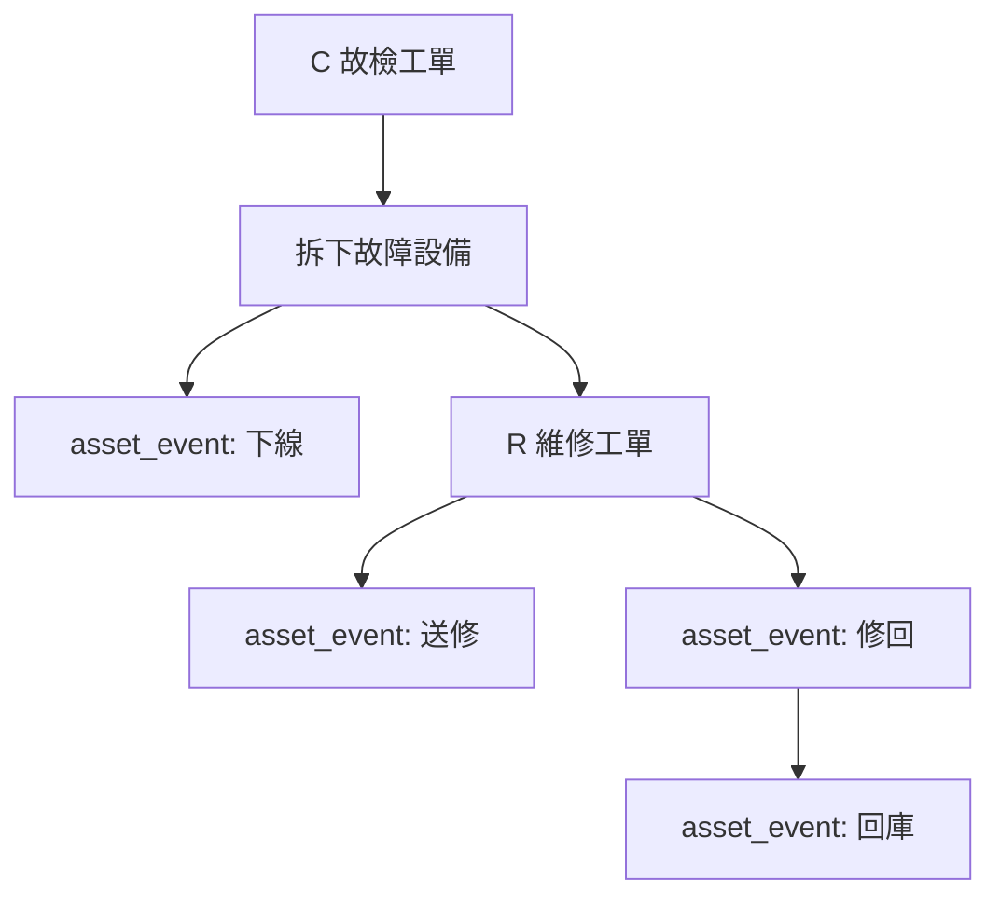

# 設備、坑位與履歷設計

## 三個核心概念

| 概念 | 資料表 | 說明 |
| --- | --- | --- |
| 物料 | `material` | 料號層級，描述這種東西是什麼。 |
| 設備序號 | `asset` | 實體設備層級，描述這一顆設備是誰。 |
| 坑位 | `vehicle_position` | 位置層級，描述設備裝在哪裡。 |

範例：

```text
material: 50.89.0004.MO 網管型乙太網路交換器
asset: serial_no = SW-001
vehicle_position: 50-D-TS101-M1-XXX
```

## 設備序號

`asset` 用於有序號、需追蹤履歷的物品：

| 欄位 | 說明 |
| --- | --- |
| `material_id` | 對應料號。 |
| `equipment_group_id` | 設備群組。 |
| `serial_no` | 設備序號。 |
| `current_status` | 目前狀態。 |
| `current_warehouse_id` | 目前倉庫/保管位置。 |
| `current_train_id` | 目前車號。 |
| `current_position_id` | 目前坑位。 |
| `current_vendor_id` | 目前廠商。 |
| `last_work_order_id` | 最近相關工單。 |

`asset.current_status` 只保存目前狀態，不能取代履歷。

## 坑位

`vehicle_position` 代表設備裝用位置。

| 欄位 | 說明 |
| --- | --- |
| `position_code` | 坑位代碼 Location_ID。 |
| `parent_position_code` | 上層坑位 Parent_ID。 |
| `site_code` | `D` 淡海、`K` 安坑。 |
| `target_code` | 通常為 `TS`。 |
| `train_id` | 所屬車號。 |
| `train_set_no` | 車組號。 |
| `module_no` | 模組/車廂。 |
| `position_type` | MODULE、CATEGORY、INDEPENDENT、ASSEMBLY、COMPONENT。 |
| `is_installable` | 是否可裝設備。 |
| `current_asset_id` | 目前裝用設備。 |

坑位是「設備在哪裡」的主檔，不是設備序號本身。

## 坑位階層



目前已建立淡海 18 台車坑位清單，來源是 `周轉建0304.xlsx`。

## 設備履歷

`asset_event` 是設備履歷核心。

所有重要狀態改變都要新增事件：

| event_type | 範例 |
| --- | --- |
| 入庫 | 新設備入庫。 |
| 上線 | 裝到車上坑位。 |
| 下線 | 從車上拆下。 |
| 送修 | 送外修廠商。 |
| 修回 | 廠商修回。 |
| 回庫 | 維修合格回備品倉。 |
| 報廢 | 設備報廢。 |

不要只更新 `asset.current_status`，一定要寫 `asset_event`，否則未來追不回來。

## C/R 與設備履歷



## 現場序號與坑位裝用匯入

| 資料表 | 用途 |
| --- | --- |
| `asset_installation_import_batch` | 匯入批次。 |
| `asset_installation_import_row` | 每一列現場盤點資料。 |

這不是庫存盤點單，而是設備序號與坑位裝用盤點，用於建立或修正「哪一顆設備裝在哪個坑位」。

現場填寫重點：

| 欄位 | 說明 |
| --- | --- |
| `position_code` | 坑位代碼。 |
| `asset_serial_no` | 設備序號。 |
| `asset_name` | 現場設備名稱。 |
| `install_state` | 裝用中、空坑、查無銘牌、與清單不符、待確認、不適用。 |
| `photo_ref` | 照片檔名或連結。 |

## 照片

目前照片先以 `photo_ref` 保存檔名或連結。後續若要正式上傳與管理檔案，可再建立共用附件表，讓工單、設備、坑位、維修紀錄都能掛照片。
