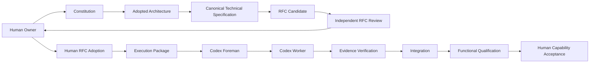
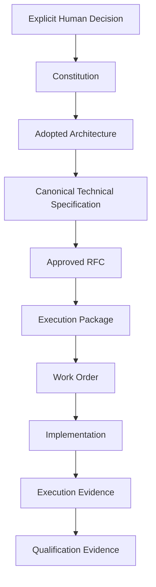
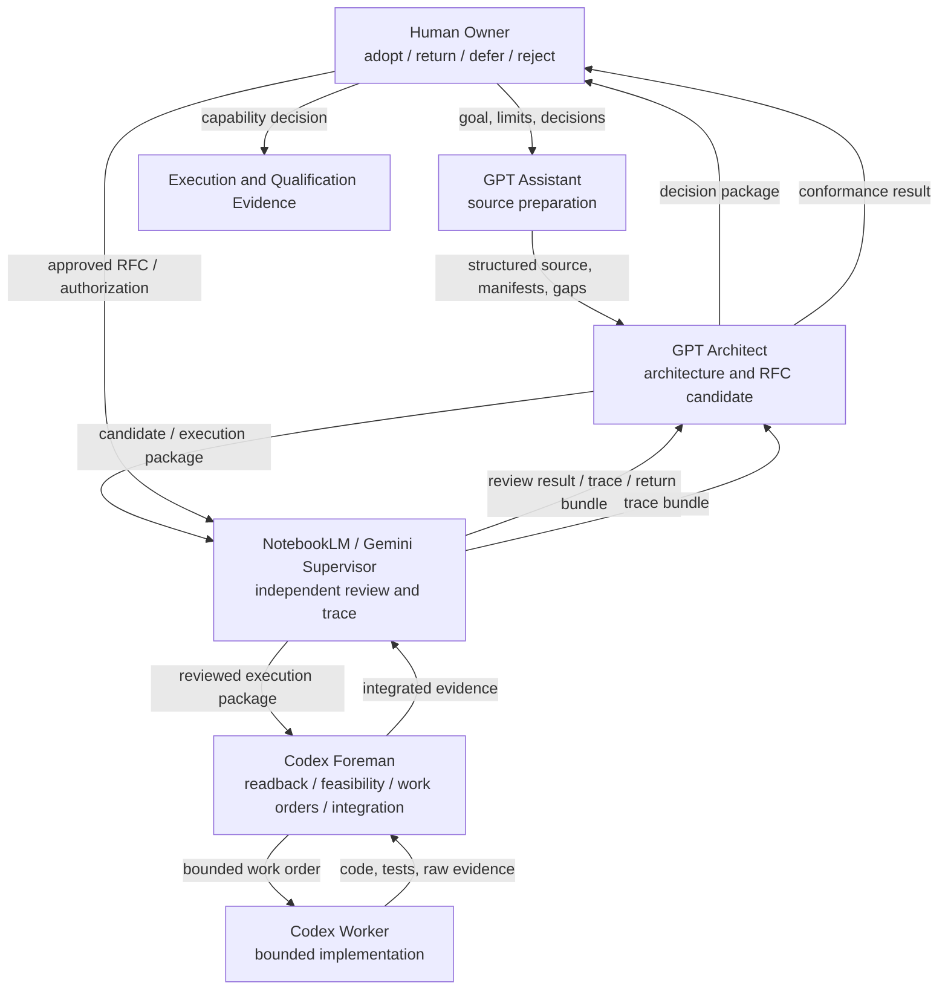
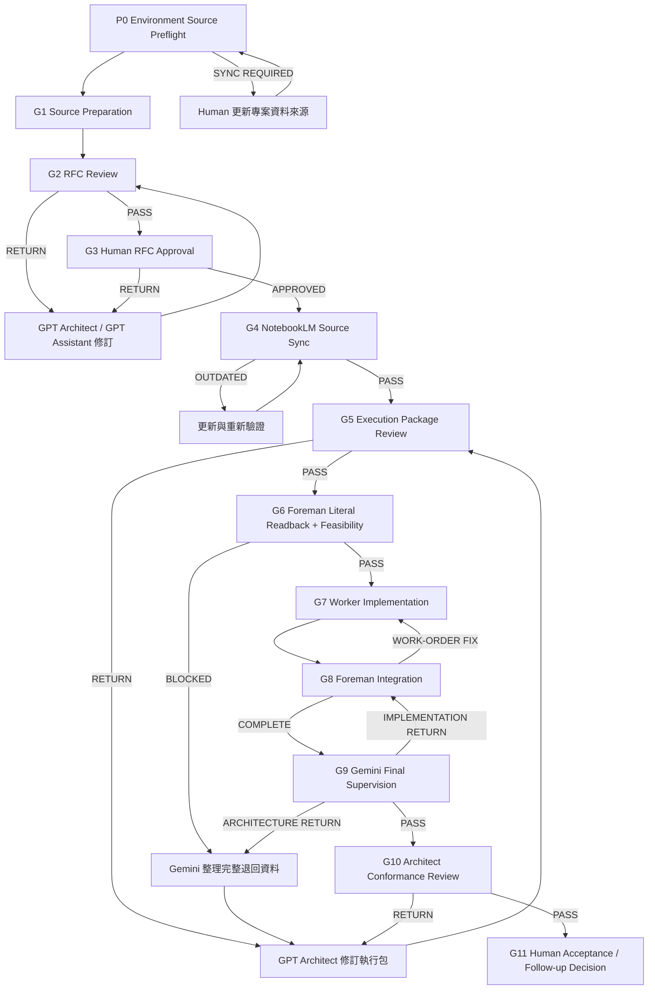
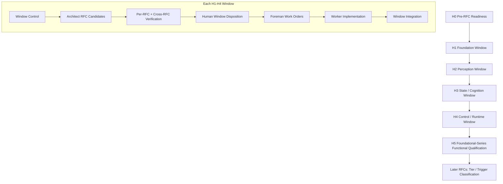
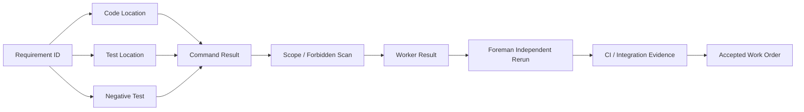
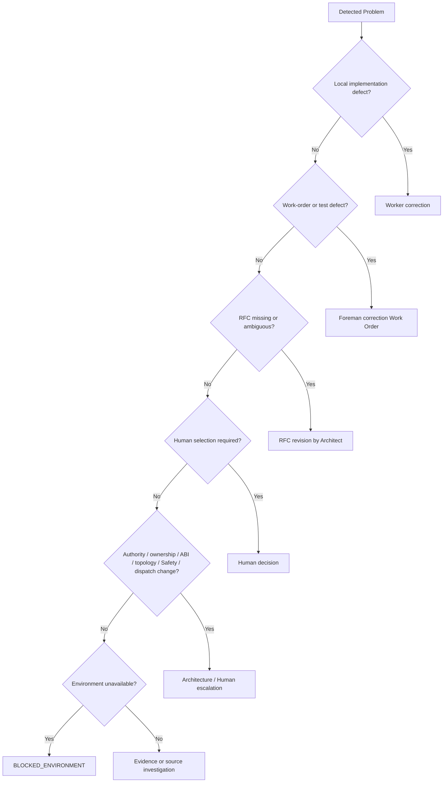
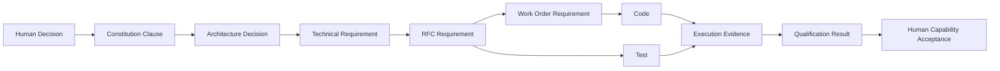

# VET-C 多方 AI 協作工程架構與 RFC 實作治理技術報告

```text
DOCUMENT_ID:
VETC_MULTI_AI_COLLABORATION_ENGINEERING_ARCHITECTURE_REPORT

VERSION:
DRAFT_v1

DOCUMENT_TYPE:
TECHNICAL_ARCHITECTURE_REPORT

PRIMARY_AUDIENCE:
VET-C / MAGP project leadership and technical reviewers

AUTHORITY_STATUS:
NON_AUTHORITATIVE_REPORT

DIRECT_PROJECT_EFFECT:
NONE

REPORT_FOCUS:
Multi-AI collaboration, authority separation, artifact handoff,
RFC governance, Codex execution control, evidence verification,
and functional qualification.

VETC_THEORY_REINTRODUCTION:
MINIMAL — only constraints relevant to the engineering-control design are included.
```

本報告說明的主要對象不是 VET-C 理論本體，而是：**如何使用 Human Owner、GPT Assistant、GPT Architect、NotebookLM／Gemini Supervisor、Codex Foreman 與 Codex Worker 等不同角色，將一個複雜 Agent 架構從來源、決策與規格，逐層轉換為可施工、可驗證、可退回、可追蹤的程式實作。**

報告同時區分三種內容狀態：

- `CURRENT_ADOPTED_AUTHORITY`：來源快照中已由 Human Owner 採用的 VET-C Constitution 或 Architecture。
- `HISTORICAL_DESIGN_SOURCE`：早期六角色協作、Source Manifest、P0／G1–G11 及審查模板；原文件狀態為 Draft／Non-authoritative／Not active。
- `PROPOSED_NEXT_PROTOCOL`：RFC Dependency Window、Evidence-bound Completion、H0–H5、Tier／Trigger 與 Functional Qualification；尚待目前 active VET-C control conversation 正式核對及規範化。

因此，本報告可作為技術說明與後續 formalization 的材料，但不會自行啟用角色、採用 RFC、授權 Codex、建立 repository、修改 Gate 或宣稱功能已完成。

---

<a id="layer-1"></a>
# 第一層：完整總體技術說明

本層可以獨立閱讀。任何核心名詞第一次出現時，都在本層交代其定義、目的、輸入、輸出、責任角色與通過方式。第二層提供精確欄位、矩陣、Gate、Artifact、狀態與退回規則。

## 1. 核心工程問題

多方 AI 協作不是把數個 AI 串接後，依序要求「整理、設計、寫程式、測試」。若所有角色都能自由解釋上游內容，系統會失去以下能力：

1. 無法判斷一項內容來自 Human decision、正式來源、Architecture interpretation，或 AI 自行補全。
2. 無法判斷 Candidate 是否已由 Human 採用。
3. 無法判斷下游 RFC、Work Order、code 或 test 是否改寫了上游意義。
4. 無法判斷 Worker 的「完成」是否代表實際符合規格。
5. 無法判斷局部測試通過是否足以支持整體 Agent capability。
6. 發生問題時，無法知道應退回 Worker、Foreman、RFC、Architecture 或 Human decision。

本架構以五項控制原則處理上述問題：

```text
PRINCIPLE_1:
ROLE_AUTHORITY_SEPARATION
任何單一 AI 不得同時產生、採用、施工與驗收同一項規格。

PRINCIPLE_2:
ARTIFACT_MEDIATED_HANDOFF
角色之間以版本化、可定位、可驗證的 Artifact 交接，不依賴口頭摘要或對話記憶。

PRINCIPLE_3:
SINGLE_ACTIVE_CONTROL_STATE
每個 Run 同一時間只有一個 CURRENT_GATE、CURRENT_ACTOR 與 AUTHORIZED_ACTION。

PRINCIPLE_4:
EVIDENCE_BOUND_COMPLETION
完成必須由 code、trace、commands、positive tests、negative tests 與獨立重跑共同支持。

PRINCIPLE_5:
TARGETED_RETURN_AND_ESCALATION
錯誤退回能解決問題的最低正確層；只有 authority、ownership、public ABI、Safety、dispatch 或 topology 問題才升級至 Architecture／Human。
```

## 2. 整體工程架構

完整控制鏈為：

```text
Human intent / source
→ explicit Human decision
→ Constitution
→ adopted Architecture
→ canonical technical specification
→ RFC Candidate
→ independent RFC review
→ Human RFC adoption
→ Execution Package
→ Foreman Work Order
→ Worker implementation
→ Foreman independent evidence verification
→ integration
→ black-box functional qualification
→ Human capability acceptance
```



這條鏈中的下游產物不能反向取得上游權威：

- code 不能改寫 RFC；
- test 不能重新定義成功語意；
- Work Order 不能增加 Approved RFC 沒有授權的功能；
- Supervisor 的 `PASS` 不能替代 Human adoption；
- Architect Candidate 不能替代 Human decision；
- source 中存在的理論內容不等於已採用、已實作或目前可用。

## 3. 六角色權限分工

六角色不是以「哪一個 AI 比較擅長」分工，而是以「哪一個角色可以決定什麼、不得決定什麼」分工。

### 3.1 Human Owner

Human Owner 是目標提供者、方案選擇者與最終採用者。Human Owner 接收 Candidate、Review、Execution Trace 與 Qualification Evidence，輸出明確的採用、退回、延後、拒絕或後續授權。日常意見、疑問與偏好不自動成為規格；需要成為正式規格時，必須被整理成可審查 Candidate，再由 Human Owner 明確採用。

### 3.2 GPT Assistant

GPT Assistant 負責來源整理、結構化、頁碼／locator、Manifest、格式統一與機械性轉換。它可以標記 `ARCHITECT_DECISION_REQUIRED`，但不能裁決來源衝突、選擇方案、補介面、修改 Tensor Contract、決定 Architecture 或直接派工給 Codex。

### 3.3 GPT Architect

GPT Architect 負責跨來源與跨 RFC 整合、Architecture interpretation、RFC Candidate、依賴／影響分析、Human decision extraction 與 Execution Package。Architect 可以提出 `PROPOSAL`，但不能採用自己的 Candidate，不能把推導寫成來源原文，也不能親自替 Worker 修改程式碼。

### 3.4 NotebookLM／Gemini Supervisor

Supervisor 負責來源完整性、Candidate 一致性、依賴、逐字回讀、執行證據與 Trace completeness。Supervisor 可指出缺漏與受影響範圍，但不能設計 Architecture、選擇方案、修改 RFC、直接指揮 Worker 或宣告 Human acceptance。

### 3.5 Codex Foreman

Foreman 位於 Approved specification 與 Worker 施工之間。Foreman負責 Execution Contract literal readback、施工可行性、工單拆分、工作區隔離、scope 控制、整合與獨立重跑。Foreman 原則上不修改程式碼；若需要補規格、改介面或放寬限制，必須停止並向上回報。

### 3.6 Codex Worker

Worker 只接收有限 Work Order，在指定工作區與檔案範圍內實作、測試並提交證據。Worker 不重新設計 Architecture，不擴大 scope，不降低測試標準，不用 placeholder 偽裝完成，遇到未定義語意、必要環境不存在或需要修改禁止範圍時必須停止。

| 行為 | Human | Assistant | Architect | Supervisor | Foreman | Worker |
|---|---:|---:|---:|---:|---:|---:|
| 採用 Constitution／Architecture／RFC | 最終決定 | 否 | 提出 Candidate | 驗證 | 否 | 否 |
| 來源結構化與 Manifest | 觸發／確認 | 主責 | 使用／要求補充 | 核對 | 否 | 否 |
| 建立 RFC Candidate | 決定必要選項 | 準備來源 | 主責 | 審查 | 否 | 否 |
| 建立 Execution Package | 授權範圍 | 機械支援 | 主責 | 預檢 | 接收 | 否 |
| 拆分 Work Order | 否 | 否 | 定義上層限制 | 核對 | 主責 | 否 |
| 修改 implementation code | 否 | 否 | 否 | 否 | 原則上否 | 主責 |
| 宣告 capability available | 最終決定 | 否 | 不能單獨宣告 | 提供驗證證據 | 提供施工證據 | 否 |

## 4. Artifact-mediated collaboration

角色之間不以「上一個 AI 說完成了」作為下一步輸入，而是使用版本化 Artifact。

主要 Artifact 包括：

```text
Source Manifest
Structured Source Bundle
Architecture Candidate / Decision Record
Human Decision Record
RFC Candidate / Approved RFC
Review and Trace Record
Execution Package
Execution Contract
Foreman Literal Readback
Work Order
Worker Result Package
Integration Record
Execution Trace Bundle
Functional Qualification Evidence
```

每個 Artifact 至少要回答：

```text
IDENTITY:
這是什麼文件或資料包？

STATUS:
SOURCE | DRAFT | CANDIDATE | APPROVED | SUPERSEDED | EVIDENCE

CREATOR:
哪個角色建立？

AUTHORIZED_INPUTS:
使用哪些版本與來源？

RECIPIENT:
下一個被授權角色是誰？

AUTHORIZED_USE:
下一個角色可用它做什麼？

INVALIDATION:
什麼情況會過期或失效？

TRACE:
如何回到來源、決策與前一個 Gate？
```

這個設計使跨工具協作不需要依賴即時 Agent-to-Agent API。Human 可以在不同平台間搬運 commit-pinned 或 hash-pinned Artifact；角色只處理明確授權的輸入。

## 5. 三個受控資料環境

歷史設計將資料來源分成三個環境，每個環境使用獨立 Source Manifest：

1. **Source Preparation**：正式來源、待忠實轉換的 Draft RFC input、轉換模板與結構化輸出。
2. **Architecture**：Current active source、Architecture control bundle、RFC bundle、Human decisions 與當前 review packet。
3. **Supervision／NotebookLM**：正式來源、Current Approved RFC、Candidate、Review target、Prompt 與 Execution Trace。

共同規則為：

- 同一資料槽位只能有一個活動版本。
- `DRAFT`、`CANDIDATE`、`APPROVED`、`SUPERSEDED` 必須明示。
- 對話摘要與 AI 記憶不是正式輸入。
- AI 只能提出 `ADD`、`REPLACE`、`REMOVE`、`DEACTIVATE` 請求；Human Owner 執行來源更新。
- 每次正式工作前執行 Source Preflight。
- 缺檔、版本不明、重複活動版本或同步過期時停止，不得用記憶補足。

## 6. 四種控制尺度

本架構同時使用四種控制尺度；四者處理不同問題，不能互相取代。

### 6.1 Execution Run Control

控制單一來源處理、RFC 建立／修訂或 implementation Run。歷史模板使用 P0 與 G1–G11，記錄 Current Gate、Current Actor、Authorized Action、active inputs、Gate result、return target 與 handoff history。

### 6.2 RFC Dependency Window

控制一組共享上游 authority、明確 hard dependency 與跨 RFC 一致性需求的 RFC。Window 不合併 RFC 身分；它只讓多份 RFC 共用 authority baseline、source manifest、dependency graph、preserved boundaries、independent review session 與 Human disposition package。

### 6.3 Work Order

控制一個有限的程式施工任務。Work Order 指定 allowed files、prohibited files、stable requirement IDs、tests、negative tests、completion commands、stop conditions 與 evidence，避免 Worker 直接解讀整套 Architecture。

### 6.4 Functional Qualification

控制整體 capability claim。它以公開入口與外部可觀察行為驗證完整 Agent 路徑，不以單一 Worker、自寫測試或局部 pytest 綠燈替代。

## 7. P0 與 G1–G11 Execution Run

歷史 Execution Run Control 的固定順序為：

```text
P0  Environment Source Preflight
G1  Source Preparation
G2  RFC Review
G3  Human RFC Approval
G4  NotebookLM Source Sync
G5  Execution Package Review
G6  Foreman Literal Readback + Feasibility
G7  Worker Implementation
G8  Foreman Integration
G9  Gemini Final Supervision
G10 Architect Conformance Review
G11 Human Acceptance / Follow-up Decision
```

其主要控制邏輯如下：

- P0 未通過，G1–G11 全部不得開始。
- G2 檢查 RFC Candidate 的來源、依賴、Selection 與受影響 RFC。
- G3 只有 Human 可以批准 RFC。
- G4 確認 NotebookLM 使用的是正確版本。
- G5 檢查 Execution Package 是否完整且沒有偷偷增加或刪減 RFC 要求。
- G6 先做 Execution Contract 逐字回讀，再做施工可行性。
- G7 Worker 依有限子工單施工。
- G8 Foreman 整合、重跑並將工單內缺漏退回 Worker。
- G9 Supervisor 檢查 RFC、工單、實作、測試與 Trace；實作問題退 Foreman，Architecture／spec 問題退 Architect。
- G10 Architect 檢查實作是否符合 Architecture intent。
- G11 Human 決定接受、退回、延後、拒絕或建立後續工作。

## 8. RFC Dependency Window

**RFC Dependency Window** 是一組具有共同上游 Architecture、明確 hard dependency、共同來源與跨 RFC 驗證需求的 RFC。

Window 的目的不是減少逐 RFC 的實質審查，而是消除重複建立控制背景的成本。

Window 共用：

```text
Authority baseline
Source manifest
Dependency graph
Preserved-boundary register
Open-decision register
Prohibited-invention register
Architect work package
Independent verification session
Human disposition package
```

每份 RFC 仍保留：

```text
RFC identity
Requirements
Dependencies
Public and internal contracts
Failure semantics
Prohibited behavior
Required tests
Verification result
Adoption status
Downstream impact
```

若某份 RFC 失敗：

- 該 RFC 不得採用；
- hard-dependent 下游進入 `HOLD_DEPENDENCY` 或重新驗證；
- shared-schema 文件執行 targeted consistency recheck；
- 無依賴的既有結果可以保留；
- authority、ownership、canonical public ABI、topology、Safety 或 dispatch 問題返回 Architecture／Human。

## 9. H0–H5 Foundational Control Sequence

H0–H5 是 `PROPOSED_NEXT_PROTOCOL`，不是現行已採用 Gate。其功能如下。

### H0 — Pre-RFC Readiness

H0 確認整個工程系統是否準備進入 RFC 編譯，而不是審查單一 RFC。

輸入包括已採用 Constitution／Architecture、Canonical Technical Specification、deferred／unresolved register、Window protocol、Foreman／Worker completion contract 與 Functional Qualification Plan。

通過結果：

```text
READY_TO_BEGIN_RFC_COMPILATION
```

若 Architecture 還不足以決定 ownership、public contract、failure semantics 或 preserved boundary，結果為 `NOT_READY`，不能把缺口交給 RFC 或 Codex 自行補全。

### H1 — Foundation Window

候選範圍包括 repository topology、canonical package root、Core ABI、shared types、validation、base interfaces、serialization identity 與 import boundary。

它建立所有下游模組共同引用的 canonical foundation。其通過條件不是目錄已建立，而是每份 RFC 與跨 RFC 定義一致，沒有第二套 public types、未授權 alias、未定義 compatibility 行為或互相衝突的 import policy。

### H2 — Perception Window

候選範圍包括 Observation、Encoder、Fusion 及 shape、dtype、mask、timestamp、batch／time axes 與 provenance。

它確保所有下游 cognition 讀取同一套輸入語意；各 Worker 不得自行決定缺失值、時間對齊、mask 或 sensor provenance。

### H3 — State / Cognition Window

候選範圍包括 Latent State、Prediction、Regime、Terrain、Memory 與內部 cognition 因果關係。

它允許模型與狀態演化被具體化，但禁止 learned state 取得 governance、Safety 或 dispatch authority；previous-cycle、reset、availability 與 capability state 必須明確。

### H4 — Control / Runtime Window

候選範圍包括 trajectory、ActionRequest、SafetyDecision、DispatchRecord、ExecutionEvidence、RuntimeState 與 RuntimeCycleRecord。

其核心通過條件包括：

- exactly one authoritative final Safety gate；
- exactly one dispatch authority；
- rejected action 導致 zero dispatch；
- proposal、safety intervention、dispatch 與 execution evidence 可追蹤；
- optional cognition 失敗不阻止形成 safety-authorized outcome；
- runtime cycle 不以 unavailable capability 偽裝成功。

### H5 — Foundational-Series Functional Qualification

H5 不再判斷 RFC 文字是否完整，而是使用預先定義的黑箱測驗，從乾淨環境走完整能力路徑：

```text
install
→ runtime start
→ observation input
→ cognition
→ ActionRequest
→ SafetyDecision
→ dispatch or explicit safe non-dispatch
→ ExecutionEvidence
→ RuntimeCycleRecord
```

H5 同時包含正常、拒絕、錯誤、fault injection 與多 cycle 情境。Critical Safety、dispatch 與 evidence chain 不得在最終資格驗證中被 mock 掉。

## 10. Codex 的 Evidence-bound Execution

Codex 施工鏈為：

```text
Approved RFC
→ Execution Package
→ Foreman Literal Readback
→ Foreman Feasibility
→ Limited Work Order
→ Worker Implementation
→ Worker Result Package
→ Foreman Independent Rerun
→ CI / integration evidence
→ Work Order Acceptance
```

Execution Contract 的逐字回讀用來證明 Foreman 接收到的是指定內容，而不是自行摘要後的版本。逐字回讀通過不代表可施工；Foreman 還必須檢查檔案、工具、權限、依賴、介面、衝突與可拆分性。

Work Order 必須指定：

```text
AUTHORIZED_BASELINE_COMMIT
IN_SCOPE / OUT_OF_SCOPE
ALLOWED_FILES / PROHIBITED_FILES
REQUIREMENT_IDS
INPUT / OUTPUT CONTRACTS
PRESERVED_INVARIANTS
PROHIBITED_BEHAVIORS
REQUIRED_POSITIVE_TESTS
REQUIRED_NEGATIVE_TESTS
COMPLETION_COMMANDS
STOP_CONDITIONS
EXPECTED_EVIDENCE
```

Worker 的自我宣告不構成完成。`PASS` 必須同時有 requirement-to-code trace、requirement-to-test trace、命令結果、negative tests、scope check、dependency check、TODO／stub check 與 unresolved items = none。

## 11. 多層驗證

本架構將「驗證」拆成不同聲明範圍：

| 層級 | 驗證內容 | 可支持的聲明 |
|---|---|---|
| Source Preflight | 輸入、版本、狀態是否正確 | 可以開始該 Gate |
| Source／RFC Trace | RFC 是否有來源與 authority | RFC Candidate 可被審查 |
| Per-RFC Review | 單一 RFC 是否完整、一致、可測試 | 該 RFC 可進入 Human disposition |
| Cross-RFC Window Review | 多份 RFC 是否共用一致 schema、依賴與 authority | Window 可採用或定向退回 |
| Execution Package Review | 工單是否忠實承接 Approved RFC | 可交給 Foreman 預審 |
| Foreman／Worker Evidence | code 是否在有限 scope 內完成 | Work Order 可接受 |
| Window Integration | 模組是否能共同工作 | Window implementation 可進入更高層驗證 |
| Functional Qualification | 外部可觀察完整能力是否成立 | capability 可交 Human 接受 |
| Live External Qualification | 真實 AirSim／硬體／外部服務是否成立 | live capability 可宣稱 available |

pytest 可以出現在多個層級，但 pytest 工具本身不決定測試是否真實。若測試只是呼叫永遠回傳 `True` 的 stub，綠燈不支持功能完成。

## 12. 後續大量 RFC 的治理方式

Foundational series 使用完整 Window governance，因為它同時固定 public ABI、authority、runtime causality 與後續施工基線。

後續工作不按 RFC 編號自動降低治理，而依影響分類：

- **Tier A／Level H**：public ABI、authority、ownership、Safety、dispatch、serialization／checkpoint compatibility、正式 external protocol、capability availability、model／release promotion。需要 Human 與獨立驗證。
- **Tier B／Level M**：已採用 Architecture 的模組、schema、FSM、training stage 或局部 algorithm contract，不新增 authority。使用批次技術驗證與 Human batch disposition。
- **Tier C／Level L**：helper、CLI、fixture、logging、internal refactor 或不改 public contract 的最佳化。使用 Foreman、CI 與 evidence。

任何 Tier B／C 工作只要觸及 Tier A trigger，就必須升級，不能因原本分類較低而繞過重驗證。

## 13. 現行來源快照與聲明邊界

截至本報告使用的來源快照：

```text
ACTIVE_CONSTITUTION:
RUN-0006 Constitution Baseline — Approved v1

ADOPTED_FOUNDATION_ARCHITECTURE:
GF-T04_TRACED_SRC_LAYOUT_HYBRID
RUN0008-CORE-ABI-CANDIDATE-GFT04-V1
18 public objects

APPROVED_RFC_COUNT:
0

IMPLEMENTATION_REPOSITORY:
NOT_CREATED in the cited adopted foundation decision

CODEX:
NOT_AUTHORIZED in the cited adopted foundation decision

IMPLEMENTATION:
NOT_AUTHORIZED in the cited adopted foundation decision
```

此快照只用來說明多 AI 工程架構所處位置。若 active project conversation 已完成 RUN-0009 adoption 或後續工作，正式對外報告前應更新本節，不應用本報告覆蓋較新的 authority。

---

<a id="navigation"></a>
# 報告導航與圖表索引

| 想了解的問題 | 主要章節 |
|---|---|
| 整套多 AI 協作如何運作？ | [整體工程架構](#overall-architecture-detail) |
| 各角色誰能決定什麼？ | [六角色責任規格](#role-specification) |
| 如何避免工具讀到舊來源？ | [Source Manifest 與 Preflight](#source-control) |
| 單一 RFC／實作 Run 如何流動？ | [P0／G1–G11](#execution-run-control) |
| RFC 如何由來源轉成工程契約？ | [RFC 建構規格](#rfc-construction) |
| Window 是什麼、有哪些？ | [Dependency Window](#dependency-window-detail) |
| Codex 怎麼避免自己補規格？ | [Codex 施工控制](#codex-execution-detail) |
| 如何證明不是虛假完成？ | [Evidence-bound Completion](#evidence-bound-completion) |
| 最終功能驗證怎麼做？ | [Functional Qualification](#functional-qualification) |
| 如何避免流程重新變笨重？ | [Lean Control](#lean-control) |
| 所有專有名詞 | [名詞與狀態解釋表](#glossary) |

| Figure | 圖名 |
|---|---|
| Figure 1 | Authority-to-Qualified-Capability Overview |
| Figure 2 | Six-role Authority and Handoff |
| Figure 3 | Original P0／G1–G11 Execution Run Control |
| Figure 4 | RFC Dependency Window and H0–H5 |
| Figure 5 | Evidence-bound Codex Execution |
| Figure 6 | Verification and Return Routing |
| Figure 7 | End-to-End Traceability |

---

<a id="layer-2"></a>
# 第二層：硬核技術規格展開

<a id="overall-architecture-detail"></a>
## 14. Authority、Artifact 與狀態分離

### 14.1 權威層級



| 層級 | 建立／採用權 | 主要功能 | 不得被何者反向改寫 |
|---|---|---|---|
| Human Decision | Human Owner | 明確選擇、限制、授權、退回 | AI 推測、測試結果 |
| Constitution | Human Owner adoption | 全域不變量與 authority boundary | lower-layer RFC、code |
| Architecture | Human Owner adoption | ownership、ABI、topology、causality | Work Order、implementation convenience |
| Canonical Technical Specification | Architect Candidate + Human process | 將 Architecture 展開成可編譯規格 | Codex interpretation |
| Approved RFC | Human Owner | 可施工、可測試的工程契約 | Execution Package、tests |
| Execution Package | Architect | 把 Approved RFC 包裝成當次施工輸入 | Foreman convenience |
| Work Order | Foreman | 有限施工範圍與證據要求 | Worker preference |
| Code／Tests | Worker | 實作與局部驗證 | 上游 semantics |
| Evidence／Qualification | Foreman／Supervisor／Human | 支持完成或 capability claim | 不得自行產生新規格 |

### 14.2 狀態不可折疊

下列狀態必須分開：

```text
THEORY_OR_SOURCE_PRESENT
SPECIFICATION_CANDIDATE
HUMAN_ADOPTED_SPECIFICATION
IMPLEMENTED
TESTED
QUALIFIED
RELEASED
CURRENTLY_AVAILABLE
```

一項能力可以存在於來源，但未被採用；可以已採用但未實作；可以已實作但未通過 Qualification；可以通過 Qualification 但目前 external environment 不可用。任何版本標籤、placeholder 或成功訊息不得折疊這些狀態。

### 14.3 VET-C 對多 AI 工程的最小約束

本報告只引用與協作控制直接相關的已採用上層約束：

1. `HCI-001`：authority state 與 capability state 必須真實且可辨識。
2. `HCI-002`：proposal、safety intervention、dispatch 與 execution 必須保留 action provenance。
3. `HCI-003`：exactly one authoritative final Safety gate；exactly one dispatch authority。
4. `HCI-004`：每個 runtime cycle 必須有 safety-authorized dispatch 或明確 safe non-dispatch outcome。
5. `HCI-005`：raw unsafe output、Safety intervention、threshold／metric authority 必須可觀察、版本化、有證據。
6. `HCI-006`：active safety loop 優先於 optional background cognition。

這些約束不是由 Worker 重新解釋；它們必須透過 RFC requirement、Work Order invariant、code restriction、negative test 與 qualification scenario 向下傳遞。

<a id="role-specification"></a>
## 15. 六角色責任規格

### 15.1 Figure 2 — Six-role Authority and Handoff



### 15.2 詳細責任表

| Role | Authorized inputs | Required outputs | Non-authority | Mandatory escalation |
|---|---|---|---|---|
| Human Owner | Candidate、review、trace、options | explicit decision、authorization、priority | 不需逐頁轉換、拆工單、執行所有 tests | 多方案選擇、authority／risk acceptance |
| GPT Assistant | official source、Human task、Architect format request | structured source、locator、manifest、`ARCHITECT_DECISION_REQUIRED` | 不決定 Architecture、Selection、interface | 任何影響 technical meaning 的改寫 |
| GPT Architect | source bundle、Human decisions、Approved RFC、review trace | RFC Candidate、impact map、Execution Package、sync list | 不採用自己、不修改 code | source conflict、architecture gap、Human choice |
| Supervisor | complete source set、Candidate、Execution Package、raw Codex evidence | review result、exact-match result、trace bundle、return package | 不設計 Architecture、不核准 | stale sources、spec conflict、missing evidence |
| Foreman | reviewed Execution Package、repo state、tools | literal readback、feasibility、Work Orders、integration evidence | 不補規格、不改 RFC、原則上不改 code | missing spec、interface change、environment／permission gap |
| Worker | bounded Work Order、allowed workspace、tests | code、tests、commands、Worker Result Package | 不擴 scope、不改 interface／Architecture | requirement conflict、missing environment、forbidden-file need |

### 15.3 角色隔離的必要效果

- Candidate 產生者與最終採用者分離。
- 規格產生者與獨立檢查者分離。
- 工單拆分者與實作者分離。
- Worker 自我回報與最終完成判定分離。
- 局部施工驗收與整體 capability acceptance 分離。
- 任一 AI 角色不得同時控制來源、規格、code 與驗收四個層級。

<a id="source-control"></a>
## 16. Source Manifest 與 Environment Preflight

### 16.1 Manifest 控制模型

每個受控環境使用自己的 Manifest，記錄：

```text
SLOT_ID
EXPECTED_FILE
CATEGORY
REQUIREMENT
EXPECTED_STATUS
ACTIVE_VERSION
UPDATE_MODE
CURRENT_STATE
```

更新模式包括：

```text
ADD
REPLACE
REMOVE
DEACTIVATE
```

同一 Slot 不允許兩個活動版本。新版加入後，舊版移出活動來源或明確標記 `SUPERSEDED` 並在正式審查時取消使用。

### 16.2 Preflight 結果

```text
SOURCE_PREPARATION_PREFLIGHT:
PASS | SOURCE_PREPARATION_SYNC_REQUIRED

ARCHITECTURE_SOURCE_PREFLIGHT:
PASS | ARCHITECTURE_SOURCE_SYNC_REQUIRED

SUPERVISION_SOURCE_PREFLIGHT:
PASS | SUPERVISION_SOURCE_SYNC_REQUIRED
```

Preflight 至少檢查：

- required files complete；
- current Run inputs complete；
- stale／duplicate active files；
- status／version ambiguities；
- missing dependencies；
- unexpected files that may affect work；
- NotebookLM sync current／outdated／unverified。

### 16.3 Human-controlled source update

AI 角色可以輸出：

```text
SOURCE_SYNC_REQUEST
TARGET_ENVIRONMENT
ACTION
TARGET_SLOT_ID
NEW_FILE
NEW_VERSION
NEW_STATUS
REPLACES
REASON
REQUIRED_BEFORE_GATE
```

但實際 project-source 更新由 Human Owner 執行。更新後，下一角色必須重新 Preflight；不能因為「已提出 request」就推定同步完成。

### 16.4 Prompt 與來源分離

正式審查 Prompt 應保持短小，只指定 role、gate、target、active source scope 與 output template。長期規則、RFC、依賴、Selection 與輸出 schema 存在受控來源中，避免每次由中間角色重新轉述而產生語意漂移。

<a id="execution-run-control"></a>
## 17. 原始 P0／G1–G11 Execution Run Control

### 17.1 Figure 3 — 原始固定主流程

下圖忠實保留歷史 `EXECUTION_RUN_CONTROL_TEMPLATE_DRAFT_v1.md` 的順序與主要 return routes。它描述單一 Run，不描述多 RFC Window roadmap，也不描述 VET-C runtime data flow。



### 17.2 Run control identity

每個 Run 至少記錄：

```text
RUN_ID
RUN_TITLE
RUN_TYPE
TARGET_RFC
TARGET_RFC_VERSION
TARGET_ENVIRONMENT
CURRENT_GATE
CURRENT_GATE_STATUS
CURRENT_ACTOR
AUTHORIZED_ACTION
AUTHORIZED_NEXT_ACTOR
ACTIVE_INPUTS
REPOSITORY_BASELINE
BRANCH_OR_WORKTREE
```

每次只能有一個 `CURRENT_GATE`。前一 Gate 沒有明確 `PASS`／`APPROVED`、Current Actor 不符、input version 不一致或動作超出 authorization 時必須停止。

### 17.3 Gate 規格表

| Gate | Purpose | Required input | Responsible role | Required output | Pass condition | Return |
|---|---|---|---|---|---|---|
| P0 | 驗證環境來源 | Manifest、current Run need | 當前環境角色 | Preflight record | required inputs current、無 ambiguity | Human source sync |
| G1 | 忠實整理來源 | official sources、template | Assistant | structured source、mapping、gap list | coverage 與 locator 完整 | Assistant／Architect correction |
| G2 | 審查 RFC Candidate | source、candidate、dependencies | Supervisor | source／dependency／Selection review | 無未處理缺漏或衝突 | Architect／Assistant revision |
| G3 | 採用 RFC | reviewed Candidate、decision items | Human | APPROVED／RETURNED／DEFERRED／REJECTED | explicit Human decision | RFC revision or hold |
| G4 | 同步 supervision source | approved RFC、update manifest | Human + Supervisor verify | sync record | current approved version available | update and reverify |
| G5 | 審查 Execution Package | approved RFC set、Meta Prompt、contract、tools、tests | Supervisor | package review | package faithful、complete、non-expansive | Architect revision |
| G6 | 證明接收與可施工 | reviewed package、repo、tools | Foreman + Supervisor exact check | literal readback、feasibility | exact match + feasible without invention | Architect via complete return bundle |
| G7 | 有限施工 | Work Orders、workspace | Worker(s) | code、tests、raw evidence | per sub-work-order conditions | Worker block／Foreman |
| G8 | 整合與獨立重跑 | worker reports、branches | Foreman | integration record、tests | all bounded work integrated | Worker correction or block |
| G9 | 最終完整性監工 | RFC、Work Orders、code、tests、trace | Supervisor | completeness result、trace bundle | no missing evidence／scope drift | Foreman or Architect |
| G10 | Architecture conformity | full trace、integrated result | Architect | conformance record | implementation preserves intent and dependencies | Execution Package revision |
| G11 | 最終接受／後續決定 | conformance、evidence、open items | Human | ACCEPTED／RETURNED／DEFERRED／REJECTED／FOLLOW_UP | explicit Human decision | appropriate lower layer |

### 17.4 Gate history 與 handoff

每次角色交接與 Gate 狀態改變必須追加紀錄，不覆蓋舊紀錄：

```text
Time
From
To
Gate
Exact Inputs
Required Output
Result
Authorized Next Actor
```

Run closure 不表示規格永遠正確。後續修訂建立新 Run，不回頭靜默改寫已關閉紀錄。

<a id="rfc-construction"></a>
## 18. RFC 建構規格

### 18.1 來源轉換與 Architecture 編譯分離

GPT Assistant 的來源轉換保持忠實，使用：

```text
SOURCE_TEXT
SOURCE_REQUIREMENT_CANDIDATES
SOURCE_DEPENDENCY_CANDIDATES
SOURCE_SELECTION_CANDIDATES
MVP_BOUNDARY
COMPLETION_CRITERIA
ARCHITECT_DECISION_REQUIRED
```

GPT Architect 在 RFC Candidate 中進一步區分：

```text
SOURCE_BASIS
ARCHITECTURE_INTERPRETATION
PROPOSAL
HUMAN_DECISION_REQUIRED
```

前者是來源整理，後者是架構整合；兩層不能混寫。

### 18.2 RFC 必要內容

```text
RFC_ID
VERSION
STATUS
PURPOSE
AUTHORITY_INPUTS
SOURCE_LOCATORS
SCOPE
OUT_OF_SCOPE
UPSTREAM_DEPENDENCIES
DOWNSTREAM_DEPENDENTS
AFFECTED_RFCS
PUBLIC_CONTRACTS
INTERNAL_CONTRACTS
FAILURE_SEMANTICS
PROHIBITED_BEHAVIORS
REQUIRED_POSITIVE_TESTS
REQUIRED_NEGATIVE_TESTS
DEFERRED_ITEMS
HUMAN_DECISIONS
IMPLEMENTATION_BOUNDARY
ACCEPTANCE_CONDITIONS
```

### 18.3 Stable Requirement ID

每一項可施工需求使用穩定 ID，例如：

```text
RFCxxxx-REQ-001
RFCxxxx-INV-001
RFCxxxx-NEG-001
```

後續建立：

```text
Requirement ID
→ Code location
→ Test location
→ Command result
→ Evidence record
```

### 18.4 Dependency 與影響

每份新增或修訂 RFC 必須列：

```text
DEPENDENCIES
AFFECTED_RFCS
REQUIRED_FOLLOW_UP
```

Architect 判斷結果：

```text
NO_CHANGE
CLARIFICATION
REVISION_REQUIRED
SUPERSEDE_REQUIRED
```

Human 發現錯誤時，不直接進入 Markdown 做無追蹤 substantive patch。正確路徑為：

```text
Human correction / decision
→ canonical technical baseline update
→ affected RFC revision candidate
→ revision impact map
→ targeted reverification
```

純格式、拼字與 locator 修正可使用 `CONTROL_LAYER_NORMALIZATION`，但必須可證明沒有改變語意。

<a id="dependency-window-detail"></a>
## 19. RFC Dependency Window Protocol

### 19.1 Figure 4 — H0–H5 與 Window 路徑



H1–H4 的每個 Window 使用相同外層結構，但依賴順序與實作順序仍由各 RFC 決定。

### 19.2 Window control structure

```text
WINDOW_ID
PURPOSE
ENTRY_CONDITIONS
AUTHORITY_BASELINE
IN_SCOPE_RFCS
OUT_OF_SCOPE
HARD_DEPENDENCIES
SOFT_DEPENDENCIES
SHARED_AUTHORITY_DEPENDENCIES
SOURCE_MANIFEST
PRESERVED_BOUNDARIES
OPEN_DECISIONS
PROHIBITED_INVENTIONS
EXPECTED_OUTPUTS
PER_RFC_RESULTS
CROSS_RFC_RESULT
HUMAN_DISPOSITION
RETURN_ROUTING
EXIT_CONDITIONS
```

### 19.3 Dependency type

- `HARD_DEPENDENCY`：上游未採用或失敗，下游不得採用。
- `SOFT_DEPENDENCY`：上游變更時，下游需要 targeted recheck。
- `SHARED_AUTHORITY_DEPENDENCY`：多份 RFC 共同引用同一 ABI、schema、ownership 或 invariant；任一變更需跨文件一致性檢查。

### 19.4 Window outputs

建議最小 Artifact 組：

```text
RFC_WINDOW_CONTROL.md
N RFC Candidate files
RFC_WINDOW_REVIEW_AND_TRACE.md
HUMAN_DISPOSITION.md
```

不要求把 authority baseline、source manifest、boundary register、decision register 各拆成一份獨立 Markdown；可整合在 `RFC_WINDOW_CONTROL.md`。

### 19.5 Per-RFC 與 Window result

Per-RFC：

```text
ADOPT
HOLD_DEPENDENCY
RETURN_TARGETED
REJECT
```

Window：

```text
ADOPT_WINDOW
ADOPT_DEPENDENCY_CLOSED_SUBSET
RETURN_TARGETED
RETURN_WINDOW
ESCALATE_TO_ARCHITECTURE
```

### 19.6 Dependency-closed partial adoption

例如：

```text
RFC-A: ADOPT
RFC-B: ADOPT
RFC-C: RETURN_TARGETED
RFC-D: HOLD_DEPENDENCY because D hard-depends on C
```

A、B 必須形成 dependency-closed subset 才可採用。C 修訂時，D 與共享 C schema 的文件重新驗證；A、B 若未受影響，保留既有結果。

### 19.7 Return Window 與 Architecture escalation

`RETURN_WINDOW` 僅適用於共同根部問題：

- authority baseline 錯誤；
- source package 不完整；
- canonical identity 衝突；
- shared schema 根部錯誤；
- Constitution／HCI 違反。

`ESCALATE_TO_ARCHITECTURE` 適用於：

- ownership 未決；
- public ABI 必須改變；
- package topology 必須重設；
- Safety／dispatch authority 必須改變；
- RFC 無法在既有 Architecture 內取得唯一可施工語意。

### 19.8 Foundational Window 候選內容

實際 RFC 編號與 1000-series 終點仍未正式確定；下表描述功能群，不授權 RFC ID。

| Control point | Candidate content | Core collaboration risk controlled |
|---|---|---|
| H0 | authority、technical baseline、Window protocol、completion contract、qualification plan | 未準備好就把未知交給 RFC／Codex |
| H1 | repository、package root、Core ABI、types、checks、interfaces、serialization | 各 Worker 建立第二套 canonical foundation |
| H2 | observation、encoder、fusion、shape／dtype／mask／time／provenance | 不同模組自行解釋輸入語意 |
| H3 | latent、prediction、regime、terrain、memory、reset／availability | learned state 被誤用為 authority |
| H4 | trajectory、action、safety、dispatch、evidence、runtime | 繞過 final gate、重複 dispatch、證據斷鏈 |
| H5 | install-to-runtime black-box scenarios | 局部 tests 全綠但整體 capability 不成立 |

<a id="codex-execution-detail"></a>
## 20. Execution Package、Literal Readback 與 Feasibility

### 20.1 Execution Package

```text
APPLICABLE_APPROVED_RFCS
RELATED_RFCS
AUTHORITY_ORDER
META_PROMPT
EXECUTION_CONTRACT
EXECUTION_INSTRUCTION
ALLOWED_SCOPE
PROHIBITED_SCOPE
TOOLS_AND_PERMISSIONS
REPOSITORY_BASELINE
DEPENDENCIES
TESTS
COMPLETION_CRITERIA
FAILURE_AND_RETURN_RULES
REPORTING_SCHEMA
```

Execution Package 只能具體化 Approved RFC，不得暗中增加、刪減或改變 Architecture。

### 20.2 Literal Readback

Execution Contract 使用固定區塊：

```text
CODEX_EXECUTION_CONTRACT_BEGIN
[exact required content]
CODEX_EXECUTION_CONTRACT_END
```

Foreman 必須原樣回傳，不翻譯、不摘要、不換同義詞、不改數字形式、不省略、不在區塊內增加說明。Supervisor 執行 exact-match；語意近似不通過。

Literal Readback 證明「接收內容身分」，不證明「內容正確」或「施工可行」。

### 20.3 Feasibility

逐字一致後，Foreman 檢查：

- required files；
- tools and permissions；
- interface／input／output；
- dependencies；
- restriction conflicts；
- task decomposition；
- testability；
- workspace isolation。

結果：

```text
PASS
BLOCKED_INCOMPLETE
BLOCKED_CONFLICT
```

不可施工時，Foreman 不得補規格或替換施工目標；Supervisor 保存原始資料並退回 Architect 判定問題層。

## 21. Work Order 與 Worker Result Contract

### 21.1 Work Order schema

```text
WORK_ORDER_ID
SOURCE_RFC_IDS
SOURCE_RFC_VERSIONS
AUTHORIZED_BASELINE_COMMIT

PURPOSE
IN_SCOPE
OUT_OF_SCOPE

ALLOWED_FILES
ALLOWED_NEW_FILES
PROHIBITED_FILES

UPSTREAM_DEPENDENCIES
REQUIRED_INPUT_CONTRACTS
REQUIRED_OUTPUT_CONTRACTS

REQUIREMENTS
PRESERVED_INVARIANTS
PROHIBITED_BEHAVIORS

REQUIRED_POSITIVE_TESTS
REQUIRED_NEGATIVE_TESTS
COMPLETION_COMMANDS

STOP_CONDITIONS
EXPECTED_EVIDENCE
```

### 21.2 多 Worker

平行施工僅在下列條件成立：

- 獨立 Worktree／workspace；
- 修改範圍不重疊；
- 不共同修改同一檔案或未穩定 interface；
- 前置 dependency 已滿足；
- 每個子工單有獨立完成條件。

Worker 不自行 merge 到正式主線；Foreman決定 integration order。

### 21.3 Worker result vocabulary

```text
PASS
BLOCKED_MISSING_SPEC
BLOCKED_HUMAN_DECISION
BLOCKED_ENVIRONMENT
FAIL_IMPLEMENTATION
FAIL_TEST
SCOPE_VIOLATION
```

避免使用：

```text
MOSTLY_COMPLETE
SHOULD_WORK
PARTIALLY_DONE
IMPLEMENTED_EXCEPT...
```

### 21.4 Worker Result Package

```text
WORK_ORDER_ID
RESULT

FILES_CREATED
FILES_MODIFIED
FILES_DELETED

REQUIREMENT_TO_CODE_TRACE
REQUIREMENT_TO_TEST_TRACE

COMMANDS_EXECUTED
TEST_RESULTS
TYPE_CHECK_RESULT
LINT_RESULT
NEGATIVE_TEST_RESULTS

SCOPE_CHECK_RESULT
FORBIDDEN_PATTERN_SCAN
TODO_STUB_SCAN

DEPENDENCY_CHANGES
PUBLIC_API_CHANGES

UNRESOLVED_ITEMS
ASSUMPTIONS_MADE
```

<a id="evidence-bound-completion"></a>
## 22. Evidence-bound Completion

### 22.1 Figure 5 — 完成證據鏈



### 22.2 `PASS` 必要條件

- 每個 required requirement 有 code trace。
- 每個 required requirement 有 test trace。
- completion commands 成功。
- required negative tests 成功。
- modified files 全在授權 scope。
- 沒有未授權 dependency 或 public API change。
- required scope 沒有未批准 TODO、FIXME、stub、placeholder。
- 沒有 broad exception 後 default success。
- assumptions 全部已聲明且不改變規格。
- unresolved items = `NONE`。
- Foreman 能在固定 baseline 上獨立重現。

少一項即不能回報 `PASS`。

### 22.3 TODO／stub 掃描

靜態掃描候選：

```text
TODO
FIXME
TBD
NotImplementedError
pass
return None
return True
except Exception
mock-only production path
```

字串掃描不能單獨判斷，例如 abstract method 的 `pass` 可能合法；Foreman 必須做 contextual review。以下 production path 直接阻擋：

```python
def safety_check(...):
    return True
```

```python
def dispatch(...):
    pass
```

```python
try:
    execute()
except Exception:
    return default_success
```

### 22.4 Foreman independent rerun

Foreman 至少重新執行：

1. git diff／changed-file scope check；
2. required commands；
3. positive tests；
4. negative tests；
5. forbidden import／dependency check；
6. TODO／stub contextual check；
7. public API／schema comparison；
8. requirement trace completeness。

Worker `PASS`、Foreman `FAIL` 時，正式 Work Order result 為 `FAIL`。

### 22.5 外部環境阻擋

外部環境不存在時：

```text
RESULT:
BLOCKED_ENVIRONMENT
```

不允許以「應該可以運作」替代。

外部 adapter 可拆成：

- Port contract + fake adapter；
- static adapter implementation；
- live external integration。

前兩者可以在一般環境驗證；只有 live qualification 可支持 `LIVE_CAPABILITY_AVAILABLE`。

## 23. 驗證與退回路由

### 23.1 Figure 6 — 問題分類與最低正確退回層



### 23.2 退回矩陣

| Problem | Result | Return target | Preserved results |
|---|---|---|---|
| local code bug | `FAIL_IMPLEMENTATION` | Worker | unaffected specs／evidence |
| required test failure | `FAIL_TEST` | Worker via Foreman | upstream adopted RFC |
| forbidden-file change | `SCOPE_VIOLATION` | Foreman rejection | no acceptance of changed work |
| missing specification | `BLOCKED_MISSING_SPEC` | Architect／RFC | unaffected adopted RFC |
| unresolved option | `BLOCKED_HUMAN_DECISION` | Human | existing verified facts |
| unavailable external tool | `BLOCKED_ENVIRONMENT` | environment provisioning | static／fake results remain scoped |
| RFC hard dependency failure | `HOLD_DEPENDENCY` | affected downstream | independent upstream results |
| shared canonical conflict | `RETURN_WINDOW` | Window root | only explicitly unaffected results |
| authority／ABI／Safety change | `ESCALATE_TO_ARCHITECTURE` | Architecture + Human | implementation evidence remains non-authoritative |

## 24. 多層驗證的輸入、輸出與聲明邊界

| Verification stage | Reviewer | Input | Output | Does not prove |
|---|---|---|---|---|
| Source Preflight | environment role | manifests、active files | `PASS`／sync required | source content is technically correct |
| Source transformation review | Supervisor | source + conversion | coverage／faithfulness | architecture choice is adopted |
| RFC Candidate review | Supervisor | Candidate + sources | per-RFC result | Human adoption |
| Cross-RFC review | Supervisor | whole Window | consistency result | code works |
| Execution Package review | Supervisor | approved RFC + package | package fidelity | repository feasibility |
| Literal readback | Foreman + Supervisor | exact contract | exact match | requirement correctness |
| Feasibility | Foreman | repo／tools／package | feasible／blocked | implementation complete |
| Worker evidence | Foreman | code／tests／trace | Work Order verification | full Window works |
| Window integration | Foreman／CI | integrated modules | integration evidence | end-to-end capability |
| Functional qualification | independent execution + Human | fixed commit／environment／scenarios | qualification evidence | all future environments available |
| Live qualification | real external environment | live system | capability available evidence | universal safety outside accepted envelope |

<a id="functional-qualification"></a>
## 25. Functional Qualification

### 25.1 Qualification Plan schema

```text
QUALIFICATION_ID
QUALIFIED_CAPABILITY
AUTHORIZED_BASELINE_COMMIT
SOURCE_CONSTITUTION_AND_ARCHITECTURE
IMPLEMENTED_RFC_SET
ENVIRONMENT
PRECONDITIONS
PUBLIC_ENTRY_POINT
SCENARIOS
FAULT_INJECTION
EXPECTED_OBSERVABLE_BEHAVIOR
PROHIBITED_BEHAVIOR
EVIDENCE_REQUIREMENTS
PASS_CONDITION
BLOCKED_CONDITION
HUMAN_ACCEPTANCE_STATEMENT
```

Qualification criteria必須在 milestone 完成前定義。它可以不屬於任何一份單一 RFC 的 local tests，但不能在實作完成後臨時創造 surprise acceptance criteria。

### 25.2 Foundational scenarios

至少包括：

1. **Clean install and start**：固定 commit、lockfile、乾淨環境可重建並啟動。
2. **Normal cycle**：合法 observation 形成 cognition、ActionRequest、SafetyDecision、dispatch／safe non-dispatch、ExecutionEvidence、RuntimeCycleRecord。
3. **Unsafe action**：Safety rejection；dispatch call count = 0；拒絕原因與 evidence chain 完整。
4. **Invalid／stale observation**：不得默認有效，不得形成虛假成功。
5. **Optional cognition failure**：active safety loop 仍形成 safety-authorized outcome。
6. **Dispatch failure／acknowledgement uncertainty**：execution state 真實標記 commanded、acknowledged、estimated、unavailable 或等價狀態。
7. **Duplicate dispatch prevention**：每個 cycle 最多一個 final dispatch。
8. **Multiple cycles**：previous-cycle provenance、reset boundary、state identity 正確。
9. **Fault injection**：exception 不被吞掉為 success；failure record 可追蹤。
10. **Canonical identity**：沒有第二套 public objects、Safety authority 或 dispatch authority。

### 25.3 Mock boundary

Qualification 可使用 fake external port 測試本地系統，但不能 mock 掉「當次聲稱已驗證」的核心能力。

例如：

- 驗證 VET-C internal runtime 時，可使用 formal fake simulator port。
- 宣稱 AirSim live integration 時，不能用 fake AirSim adapter。
- 驗證 final Safety gate 時，不能把 SafetyDecision 固定 mock 為 accepted。
- 驗證 evidence chain 時，不能直接注入完成的 RuntimeCycleRecord。

### 25.4 結果

```text
PASS
FAIL
BLOCKED_ENVIRONMENT
```

Human 接受的是精確 capability statement，例如：

```text
FOUNDATIONAL_SERIES_IMPLEMENTATION_QUALIFIED:
YES | NO

AIRSIM_LIVE_INTEGRATION_AVAILABLE:
YES | NO
```

不是模糊的「整體看起來可用」。

## 26. Heavy Verification、Tier 與 Trigger

### 26.1 Verification level

| Level | Control | Typical use |
|---|---|---|
| H | Human + Architect + independent verification + pinned decision | authority、public contract、major capability |
| M | batch technical review + consistency verification + Human batch disposition | module／schema expansion without new authority |
| L | Foreman + CI + evidence | bounded implementation detail |

### 26.2 Heavy triggers

任一項成立即升級 Level H：

1. Constitution／HCI interpretation change；
2. canonical topology change；
3. public ABI object／field／semantic change；
4. ownership／authority change；
5. final Safety／dispatch causality change；
6. serialization／checkpoint compatibility change；
7. new formal external protocol；
8. unavailable／deferred capability becomes available；
9. model／checkpoint／runtime profile promotion；
10. new whole-system capability or release claim。

### 26.3 Tier classifier

| Tier | Scope | Default verification | Escalation |
|---|---|---|---|
| A | public ABI、authority、Safety、dispatch、checkpoint、external protocol | Level H | always |
| B | modules、schemas、FSMs、training stages、local algorithm contracts | Level M | any heavy trigger |
| C | helper、CLI、fixture、logging、internal refactor | Level L | public／authority impact |

Tier 不是永久標籤。實作中發現 public API 或 authority 影響時，立即停止並重新分類。

<a id="lean-control"></a>
## 27. Lean Control：避免治理再度膨脹

本架構增加的是判斷規則，不等於每次工作都重跑整套流程。瘦身原則如下。

### 27.1 Pinned baseline + delta review

後續 Gate 引用已採用 baseline，只審：

- 當次新增內容；
- 受影響條款；
- dependency propagation；
- cross-file consistency。

不在每個 Window 或 Work Order 全文重審 Constitution。

### 27.2 控制文件預算

每個 Window 預設不超過四類控制產物：

1. Window Control；
2. RFC Candidate files；
3. Window Review and Trace；
4. Human Disposition。

Requirement coverage、hash、changed-file list、test output、TODO scan、public API diff 應盡量由工具產生。

### 27.3 Heavy verification 預算

Foundational sequence 候選重 Gate 為 H0–H5；一般 Work Order 不送 NotebookLM，也不要求 Human 逐張批准。

### 27.4 例外升級，不是普遍升級

```text
implementation bug
→ Worker

test／scope defect
→ Foreman

missing specification
→ RFC

multiple valid options
→ Human

authority／ownership／ABI／Safety／dispatch
→ Architecture + Human
```

### 27.5 不建立平行 authority

新的 formal protocol 應優先修改或整合既有控制文件，不為每個概念新增一份 authority document。模板描述欄位；adopted protocol 定義規則；Run instance 記錄當次狀態，三者不得混用。

## 28. End-to-End Traceability

### 28.1 Figure 7 — 完整追蹤鏈



### 28.2 Trace matrix

| Trace edge | Required identity |
|---|---|
| Human → Constitution | decision ID／adoption record |
| Constitution → Architecture | HCI applicability／preservation result |
| Architecture → Technical spec | architecture decision ID |
| Technical spec → RFC | source locator + requirement ID |
| RFC → Work Order | approved RFC version + requirement subset |
| Work Order → Code | file／symbol location |
| Requirement → Test | test ID／scenario |
| Code／Test → Evidence | commit、command、result、logs |
| Evidence → Qualification | fixed baseline + scenario result |
| Qualification → Human | exact capability statement |

任何一段缺失都必須標記 `BLOCKED_MISSING_EVIDENCE` 或更精確的阻擋狀態，不能以摘要推定。

## 29. Current、Historical 與 Proposed 的整合邊界

| Content | Status in this report | Treatment |
|---|---|---|
| RUN-0006 Constitution baseline | Current adopted authority in source snapshot | 可引用，不由本報告修改 |
| RUN-0008 topology + Core ABI | Current adopted Architecture in source snapshot | 可作為 boundary example |
| 六角色 Charter／Role Drafts | Historical design source | 說明設計，不宣稱 active |
| P0／G1–G11 Run Control | Historical design source | 忠實呈現，待 formalization 決定是否延續／修訂 |
| Source Manifests／Review templates | Historical design source | 作為 source-control／trace pattern |
| Dependency Window | Proposed next protocol | 待 active conversation reconcile |
| Evidence-bound completion | Proposed next protocol | 待 formalization |
| H0–H5 | Proposed next protocol | 名稱、數量、membership 尚未採用 |
| Tier A／B／C | Proposed next protocol | 待建立 classifier |
| Codex execution | Not authorized in cited adopted snapshot | 本報告不啟動 |
| Implementation／functional qualification | Not yet demonstrated in cited snapshot | 不得宣稱完成 |

## 30. 尚待正式決定的事項

1. Foundational RFC series 的確切編號範圍；目前存在 1000–1015 與 1000–1016 的口頭差異。
2. H1–H4 各 Window 的正式 RFC membership。
3. H0–H5 是否使用目前名稱及是否全部保留。
4. Foreman、Worker 在實際 repository 的 permission boundary。
5. Worker result schema 與 automated evidence tooling。
6. NotebookLM 的正式 input／output contract 與 source sync 方法。
7. Tier A／B／C classifier 的正式判定表。
8. AirSim、training、checkpoint、model promotion 與 release qualification milestone。
9. 歷史 P0／G1–G11 是否原樣延續，或被 Window protocol 包覆後局部修訂。
10. 本報告內容應整合到既有 control protocol，或形成一份新的 compact specification。

---

<a id="source-basis"></a>
# 來源基礎與狀態

本報告使用下列來源。Hash 用於識別本次報告所讀取的檔案，不表示該檔案因此被採用。

| ID | File | Status used in report | SHA-256 |
|---|---|---|---|
| S01 | `AI_COLLABORATION_CHARTER_DRAFT_v1.md` | `HISTORICAL_DESIGN_SOURCE` | `1836cab77cd0bd4640eccf75694bddb32086605a4c8a39ef88f983d04134e12d` |
| S02 | `HUMAN_OWNER_ROLE_DRAFT_v1.md` | `HISTORICAL_DESIGN_SOURCE` | `ea6616f0022ac6fedfa5ee61ae8037e5c0aca648ec8312548af5c61699e7e16d` |
| S03 | `GPT_ASSISTANT_ROLE_DRAFT_v1.md` | `HISTORICAL_DESIGN_SOURCE` | `ecd37e130e5cf55a67a15436e18f96538fbc21045b42e6dd8d9c9a2b7fe55377` |
| S04 | `GPT_ARCHITECT_ROLE_DRAFT_v1.md` | `HISTORICAL_DESIGN_SOURCE` | `c8c4c5076ab284d32228b0ee2cb8c7b5d3ed0d51eeaa0d90823ca83eecff1887` |
| S05 | `GEMINI_SUPERVISOR_ROLE_DRAFT_v1.md` | `HISTORICAL_DESIGN_SOURCE` | `bf46149180ea2c0e5b884b3b711a5d82e88279989e03645b4bdcffc50361f5da` |
| S06 | `CODEX_FOREMAN_ROLE_DRAFT_v1.md` | `HISTORICAL_DESIGN_SOURCE` | `d362f5a9babc52b64c033f0800b15ead174bab4ce8b849f9683b6f11635da451` |
| S07 | `CODEX_WORKER_ROLE_DRAFT_v1.md` | `HISTORICAL_DESIGN_SOURCE` | `ca050f4f0ec92260ed41249cbf2c97e0540e9989188ccfe71622d545e08ea089` |
| S08 | `EXECUTION_RUN_CONTROL_TEMPLATE_DRAFT_v1.md` | `HISTORICAL_DESIGN_SOURCE` | `ac14e0a298ea7d586d03667f14377f19d2162bd182695aa5e23cb147240ea6c2` |
| S09 | `ARCHITECTURE_SOURCE_MANIFEST_DRAFT_v1.md` | `HISTORICAL_DESIGN_SOURCE` | `48344e72cabbb619cbcd444715a762a7dc4c890cff78c236a62950d13a02c7eb` |
| S10 | `SOURCE_PREPARATION_SOURCE_MANIFEST_DRAFT_v1.md` | `HISTORICAL_DESIGN_SOURCE` | `38ff37cde57c6b1044c062ada594488500baa3c97cc05da7ae3dddf57d2af11e` |
| S11 | `RFC_SOURCE_TRANSFORMATION_TEMPLATE_DRAFT_v1.md` | `HISTORICAL_DESIGN_SOURCE` | `4c4cc3845dcc6a245ad11370205974b4cb881ca5a59d92d1bc5a5b8f2a9f0dc1` |
| S12 | `SUPERVISION_SOURCE_MANIFEST_DRAFT_v1.md` | `HISTORICAL_DESIGN_SOURCE` | `9bc2e936ae69b297c15a1ab9ac43ce81bec92c4d2477763fb0c275862f90dcbc` |
| S13 | `GEMINI_REVIEW_AND_TRACE_TEMPLATE_DRAFT_v1.md` | `HISTORICAL_DESIGN_SOURCE` | `6ed9ad9c386668aa4a4968fc1d34325a203a5fc115d8f11b150c07f835863734` |
| S14 | `RUN-0006_CONSTITUTION_BASELINE_APPROVED_v1.md` | `CURRENT_ADOPTED_AUTHORITY` | `414777dc05bd0ec2ff01e972f375e4da6f4b3a34ab3975249a878d2305697837` |
| S15 | `RUN-0008_FOUNDATION_ARCHITECTURE_DECISION_ADOPTED_v1.md` | `CURRENT_ADOPTED_AUTHORITY` | `8019b8dc631988ed31d7898aba79533d7ab85a09741c36353d3f01dedd85d0f2` |
| S16 | `VETC_PRE_RFC_TRANSITION_CONTROL_HANDOFF_CANDIDATE_v1.md` | `PROPOSED_NEXT_PROTOCOL` | `d4be0b694e9b3b8ec7942d1aedc337522017a299a15911ad42acf1fa1d64ce9e` |

---

<a id="glossary"></a>
# 名詞與狀態解釋表

正文首次出現時已提供簡短定義；本表提供跨章節一致的精確用法。

## A. 權威與規格

| 名詞 | 定義 | 不代表 |
|---|---|---|
| Human Owner | 唯一具有正式採用、退回、延後、拒絕與風險接受權的角色 | 日常談話自動成為規格 |
| Human Decision | Human Owner 明確作出的可定位決定 | AI 的推薦或推定 |
| Constitution | 最高層 invariant、authority、causality 與 lifecycle boundary | class、field、algorithm 或 implementation order |
| HCI | Human-approved invariant；對後續 Architecture、RFC 與 code 具約束力 | 已完成的實作 |
| Architecture | ownership、public ABI、topology、authority、data／control boundary | 單一 Work Order |
| Canonical Technical Specification | 將 adopted Architecture 展開為可編譯 RFC 的一致技術基線 | Codex 的自由解讀 |
| RFC | 可追蹤、可測試、可施工的工程契約 | 一般敘事文件 |
| Candidate | 尚待 Human disposition 的產物 | Approved |
| Approved／Adopted | Human 已明確採用 | AI 認為正確 |
| Superseded | 已被後續版本取代，不得作為 active authority | 可與新版共同活動 |
| Capability State | available、unavailable、deferred、approximate、invalid 等可驗證狀態 | 版本名稱或 placeholder |

## B. 角色

| 名詞 | 定義 |
|---|---|
| GPT Assistant | 來源整理、locator、Manifest、機械性轉換角色 |
| GPT Architect | Architecture integration、RFC Candidate、impact、Execution Package 角色 |
| NotebookLM／Gemini Supervisor | 獨立於產生者的來源、一致性、literal、evidence 與 trace 審查角色 |
| Codex Foreman | readback、feasibility、Work Order、scope、integration、independent rerun 角色 |
| Codex Worker | 依 bounded Work Order 實作與提交 raw evidence 的角色 |
| Role Boundary | 角色可讀取、可輸出、可決定、不得執行與必須升級的範圍 |
| Non-authority | 該角色可以提供 evidence 或 recommendation，但不能採用規格 |

## C. 流程

| 名詞 | 定義 | 不代表 |
|---|---|---|
| Run | 一次受控來源／RFC／實作工作週期 | 整個專案 |
| Gate | 有 entry、actor、output、pass、return 的控制節點 | 每個 Gate 都要重審全部 authority |
| P0 | Environment Source Preflight | 技術內容已正確 |
| Execution Run Control | 控制單一 Run 的 P0／G1–G11 狀態 | RFC series roadmap |
| Dependency Window | 共用 authority、source、dependency 與 cross-RFC review 的 RFC 集合 | 合併 RFC 身分 |
| Heavy Gate | 涉及 authority、public contract 或 capability claim 的重量級控制點 | 每張 Work Order |
| Tier | 後續工作依風險與影響使用的治理級別 | 由 RFC 編號自動決定 |
| Targeted Return | 只退回問題項與受影響下游 | 全部重做 |
| Dependency-closed Subset | 所有 hard dependencies 都已包含且可成立的可採用子集 | 任意挑選部分 RFC |

## D. Artifact

| 名詞 | 定義 |
|---|---|
| Artifact | 可版本化、可定位、可交接、可驗證的工作產物 |
| Source Manifest | 記錄 active files、status、version、slot 與 update rule |
| Structured Source Bundle | 忠實整理後的來源與 locator |
| Human Decision Record | 保存 Human 明確決定的 Artifact |
| Review and Trace | 保存來源、依賴、一致性、缺漏、result 與 evidence |
| Execution Package | Approved RFC 到 Foreman 之間的完整施工輸入 |
| Meta Prompt | 定義角色如何閱讀 RFC；不得改變 RFC semantics |
| Execution Contract | Foreman 必須逐字回讀的固定內容 |
| Literal Readback | Foreman 原樣回傳 Execution Contract，確認接收身分 |
| Work Order | Foreman 派給 Worker 的有限施工契約 |
| Worker Result Package | code、tests、commands、trace、scope 與 unresolved items |
| Execution Trace Bundle | 保存整條執行鏈原始 Prompt、回報、命令、測試與決定 |
| Revision Impact Map | 修訂影響的 requirements、RFC、tests 與 preserved results |
| Qualification Evidence | 支持完整 capability statement 的環境、commands、logs 與 scenario result |

## E. 驗證

| 名詞 | 定義 |
|---|---|
| Source Preflight | 驗證來源存在、版本與狀態正確 |
| Source Trace | 從 RFC statement 回到 source locator／Human decision |
| Per-RFC Review | 單一 RFC 的完整性、一致性、可測試性 |
| Cross-RFC Review | Window 內 dependency、schema、authority 與 semantics 一致性 |
| Contract Test | 驗證局部 interface／requirement |
| Negative Test | 驗證禁止行為、拒絕路徑與錯誤處理 |
| Integration Test | 驗證多模組共同工作 |
| Evidence-bound Completion | completion 由可重現 code、trace、commands、tests、scope evidence 支持 |
| Functional Qualification | 以公開入口與可觀察行為證明完整能力 |
| Live External Qualification | 在真實外部環境證明 live integration |
| Mock | 隔離依賴的替代物；不得取代當次聲稱被驗證的核心能力 |
| Fault Injection | 主動製造故障以驗證 failure semantics 與 evidence |

## F. 狀態與結果

| 狀態 | 定義 |
|---|---|
| `PASS` | 指定範圍內所有完成條件與 evidence 成立 |
| `PASS_WITH_NOTES` | 指定檢查未發現阻擋，但存在不改變 result 的 notes |
| `ADOPT` | Human 採用 Candidate |
| `HOLD_DEPENDENCY` | 本項因 hard dependency 未成立而暫停 |
| `RETURN_TARGETED` | 退回問題項與受影響下游 |
| `RETURN_WINDOW` | Window 共同根部發生 authority／source／canonical conflict |
| `BLOCKED_MISSING_SOURCE` | 缺少必要來源 |
| `BLOCKED_MISSING_SPEC` | 規格不足，實作者不得自行補全 |
| `BLOCKED_HUMAN_DECISION` | 必須由 Human 選擇 |
| `BLOCKED_MISSING_EVIDENCE` | 無法支持完成聲明 |
| `BLOCKED_ENVIRONMENT` | 必要工具、權限或 external environment 不存在 |
| `BLOCKED_CONFLICT` | source、RFC、Work Order 或 restriction 衝突 |
| `FAIL_IMPLEMENTATION` | code 實作失敗 |
| `FAIL_TEST` | required test 失敗 |
| `SCOPE_VIOLATION` | 修改或行為超出 Work Order |
| `ESCALATE_TO_ARCHITECTURE` | 問題涉及 ownership、authority、ABI、topology、Safety 或 dispatch |
| `NOT_AUTHORIZED` | 尚無明確 Human authorization，不得執行 |
| `NOT_IMPLEMENTED` | 規格可能存在，但 code 尚未完成 |
| `UNAVAILABLE` | capability 目前不能在 active environment 使用 |
| `DEFERRED` | 已明確延後，不能表示為已完成 |

---

# 報告結論

本架構將多方 AI 協作拆成三條互相制約的鏈：

```text
AUTHORITY_CHAIN:
Human → Constitution → Architecture → Approved RFC

EXECUTION_CHAIN:
Execution Package → Foreman → Worker → Integration

EVIDENCE_CHAIN:
Source Trace → Review → Worker Evidence → Functional Qualification → Human Acceptance
```

三條鏈不允許由同一角色同時控制，也不允許下游產物反向取得上游權威。

RFC Dependency Window 解決多份相互依賴 RFC 的治理尺度；P0／G1–G11 解決單一 Run 的受控流動；Work Order 解決有限程式施工；Functional Qualification 解決整體 capability claim。Targeted Return、Evidence-bound Completion 與 Trigger-based Heavy Verification 使高風險邊界維持強驗證，而一般 implementation defect 不必重啟完整治理循環。

本報告本身不使任何 Candidate 生效。下一個正式動作應由目前 active VET-C control conversation 對照最新 Constitution、Architecture、Human decisions 與 Gate，決定哪些內容：

```text
SUPPORTED_FOR_FORMALIZATION
SUPPORTED_WITH_MODIFICATION
ALREADY_COVERED
CONFLICTING
DEFERRED
HUMAN_DECISION_REQUIRED
REJECTED
```
