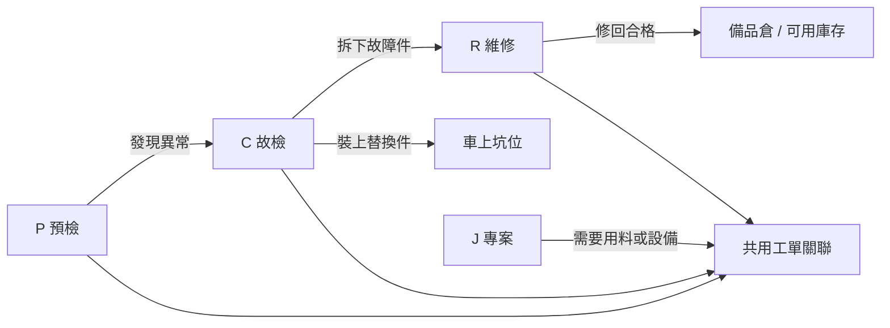
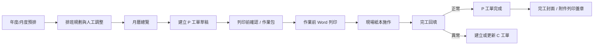
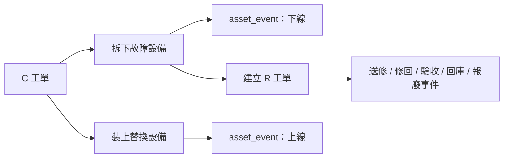
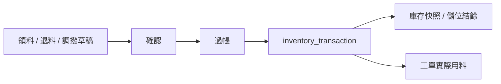

# 輕軌維修系統前端總藍圖

更新日期：2026-07-10

## 1. 文件定位

本文件定義新 React 前端的正式邊界。舊版 `預檢工單系統_物料表調整版.html` 只保留為功能與操作流程參考，不再作為新功能的實作位置。

第一原則：畫面依業務責任拆分，所有模組共用同一套 API、資料庫、登入身分、主檔與狀態定義。

## 2. 系統目標

新系統應完成以下工作：

1. 用單一入口整合故障工單、預檢、周轉件、物料與主檔。
2. 讓 P、C、R、J 工單共用工單主檔，但保留各自流程。
3. 所有狀態與履歷進 PostgreSQL，不再以 HTML 假資料或 localStorage 作正式資料來源。
4. 大型表格與矩陣保持工作型介面，優先支援掃描、篩選、比較與重複操作。
5. 正式列印使用原始 Word 範本；HTML 只負責資料確認與操作。
6. 可輸出單一 HTML 作為展示版，但正式環境仍由 API 提供資料與權限。

## 3. 六個正式模組

| 模組 | 主要責任 | 不負責 |
| --- | --- | --- |
| 主儀表板 | 跨模組待辦、異常、今日工作與管理摘要 | 不直接編輯主檔或工單 |
| 工單管理 | C 故檢、R 維修、J 專案與全部工單查詢 | 不承擔 P 工單的排程、列印、回填工作區 |
| 預檢管理 | P 工單的預排、月曆、作業包、列印、回填與排班規劃 | 不重複維護儀器、WI、用料主檔 |
| 周轉件管理 | R 單清冊、坑位現況、設備序號履歷與備品位置 | 矩陣不執行正式工單動作 |
| 物料庫存 | 物料查詢、領退調撥、庫存位置、用量與補料判斷 | 不建立採購單與正式盤點單 |
| 主檔設定 | 人員權限、車輛設備、儀器、WI、範本、倉儲與流程選項 | 不呈現作業清單與履歷 |

## 4. 工單責任

| 工單 | 中文 | 作業入口 | 核心責任 |
| --- | --- | --- | --- |
| P | 預檢工單 | 預檢管理 | 定期預防檢修、作業前列印、完工回填 |
| C | 故檢工單 | 工單管理；也可由 P 回填異常建立 | 故障排除、現場拆裝、坑位與異常來源 |
| R | 維修工單 | 工單管理與周轉件 R 單清冊 | 拆下壞件的內修、外修、驗收、回庫或報廢 |
| J | 專案工單 | 工單管理 | 改善、改造、批次與非例行工作 |



## 5. 資料責任

| 資料域 | 正式來源 |
| --- | --- |
| 使用者、車輛、倉庫、流程選項 | 共用主檔表 |
| P/C/R/J 工單 | `work_order` 與四種工單明細表 |
| 物料與庫存 | `material`、庫存單據、庫存履歷與 balance/view |
| 設備序號與坑位 | `asset`、`vehicle_position`、`asset_event` |
| 預檢模板 | `pm_template` 與用料、儀器、WI、檢查項目關聯 |
| 預檢結果 | `pm_work_order_check_result` |

前端不得直接更新設備快照或庫存 balance。設備狀態改變要新增 `asset_event`；庫存改變要由異動單或 movement API 過帳。

## 6. 跨模組主流程

### 6.1 預檢流程



### 6.2 C 接 R 與設備履歷



### 6.3 庫存流程



## 7. 共用前端架構

建議目錄：

```text
src/
  app/                 路由、權限、全域 provider
  layouts/             共用外框與導覽
  modules/             六個業務模組
  shared/
    api/               API client、錯誤與分頁契約
    auth/              身分、角色與權限判斷
    components/        共用工作型元件
    hooks/             共用查詢與操作 hook
    types/             共用 DTO 與 domain types
    utils/             日期、民國年、工單號與格式化
```

後續套件原則：

| 用途 | 建議 |
| --- | --- |
| 路由 | React Router，已採用 HashRouter |
| Server state | TanStack Query |
| 表單 | React Hook Form + Zod |
| 日期 | date-fns；另建民國年轉換工具 |
| 圖示 | lucide-react |
| 本地狀態 | React state/context；沒有明確需求前不加入 Redux |

## 8. 共用設計元件

所有模組共用以下元件，不各自重畫：

- `AppShell`、`SidebarNav`、`Topbar`
- `PageHeader`、`ActionBar`、`SegmentedTabs`
- `FilterBar`、`SearchField`、`DateRangeField`
- `DataTable`、`StickyMatrix`、`DetailPane`、`FormDrawer`
- `StatusBadge`、`RiskTag`、`MetricStrip`
- `EmptyState`、`LoadingState`、`ErrorState`
- `ConfirmDialog`、`UnsavedChangesDialog`、`Toast`
- `Timeline`、`AttachmentList`、`AuditTrail`
- `PrintPreparation`、`PrintJobHistory`

## 9. 權限與稽核

| 角色 | 主要權限 |
| --- | --- |
| 系統管理員 | 全部模組與主檔 |
| 維修主管 | 工單核准、排班、完工、報表 |
| 排程人員 | 預排匯入、排班調整、P 工單建立 |
| 維修人員 | 接單、回填、異常通報 |
| 倉管人員 | 物料、領退調撥、儲位 |
| 唯讀人員 | 查詢、報表與歷史 |

所有正式操作保存 `created_by`、`updated_by`、時間與必要的 change log。刪除主檔原則上採停用，不做實體刪除。

## 10. 最新決策優先順序

若舊文件與本藍圖衝突，以本藍圖與後續模組規格為準：

1. 新 React 前端是正式方向；legacy HTML 只讀參考。
2. 左側只有六個主模組，不使用 iframe。
3. P 流程留在預檢管理；C/R/J 留在工單管理。
4. 周轉件坑位矩陣右側只顯示現況，不放履歷 Tab 或正式操作。
5. R 單清冊是周轉件首頁的正式作業入口。
6. Word 原始版面不可改，作業前與完工後各自保留列印情境。
7. 物料系統不做採購流程與正式盤點單。
